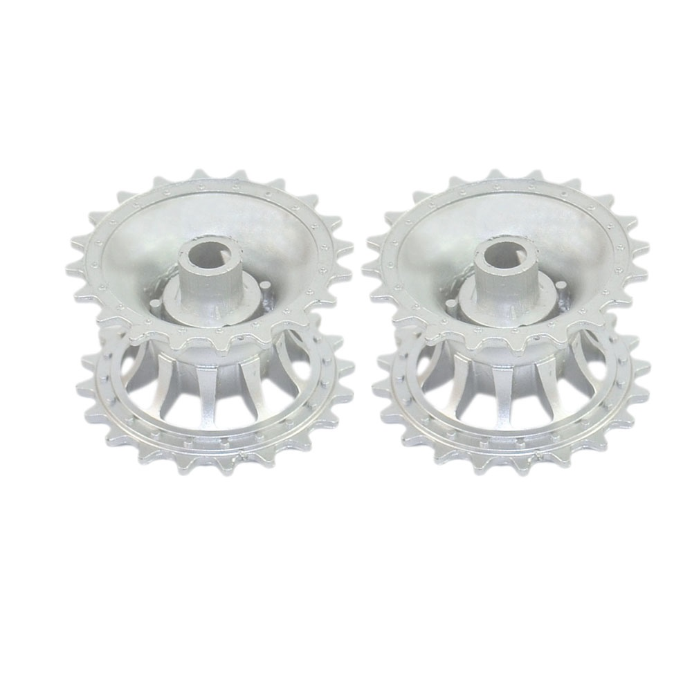
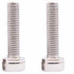
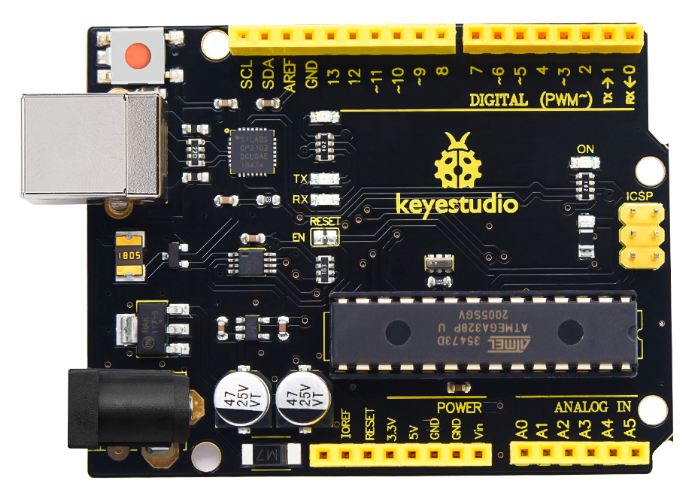
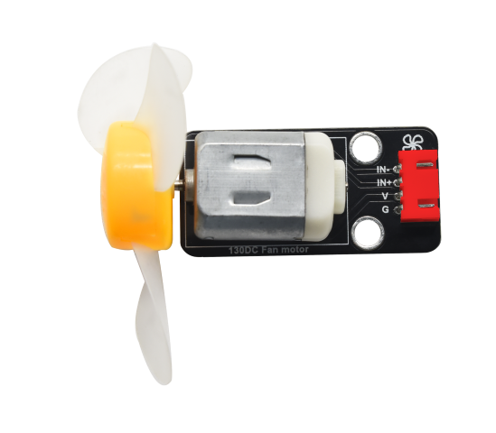
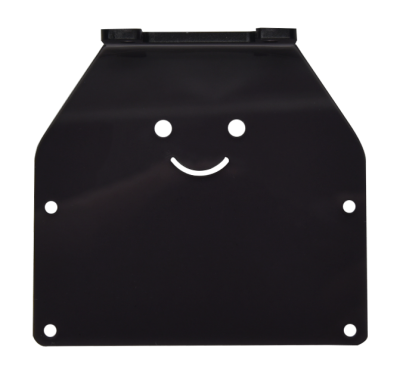
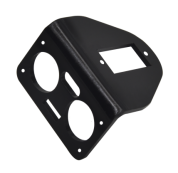
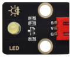
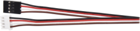
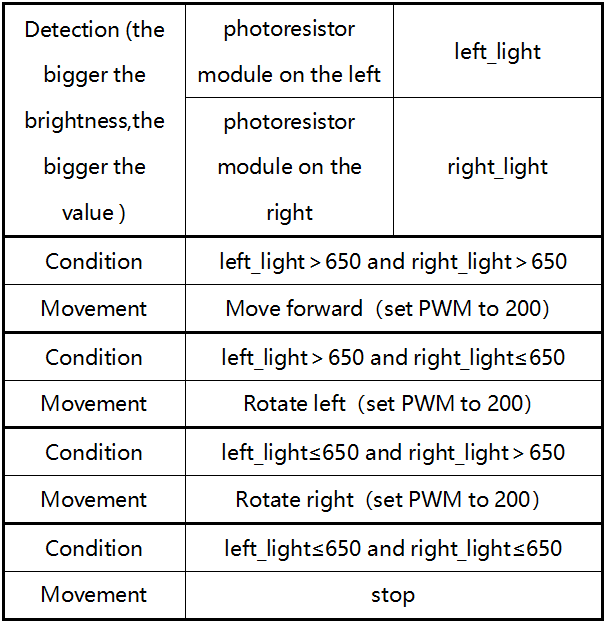
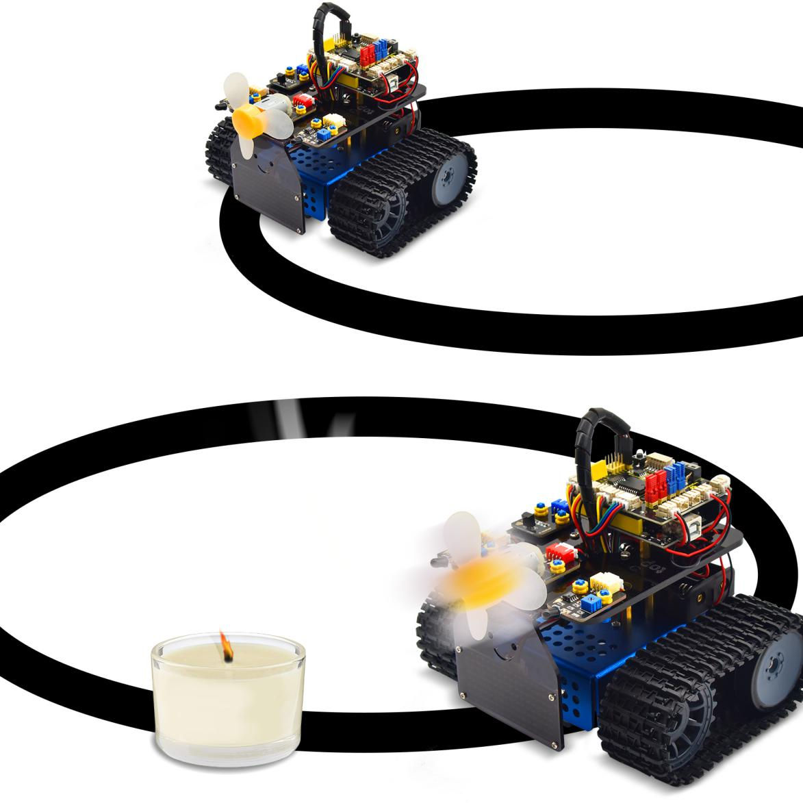

# Arduino-KS0526 Keyestudio Mini Tank Robot V3


## **Read me frist**

 **Download the APP, Code and library from the link: <https://fs.keyestudio.com/KS0526>**

## **1. Introduction**

This STEM educational V3.0 tank robot is newly upgraded, adding an line-tracking and a fire- extinguishing function. It vigorously enhances the relationship between kids and parents, and sparks children’s imagination through programming and coding.

In the course of assembly process, you can see its multiple functions like light following, line tracking, IR and BT remote control, speed adjustment and so on. Additionally, there are some small parts that can help you assemble the robot car.

There are basic sensors and modules, such as a flame sensor, a BT sensor, an obstacle avoidance sensor, an line tracking sensor and an ultrasonic sensor are included.

The two tutorials for C language and Arduino are also suitable for the enthusiasts at different ages.

It is really the best choice for you.

## **2. Features：**

1. Multiple functions：Confinement, line tracking, fire extinguishing, light following, IR and BT remote control, speed control and so on

2. Easy to build: assemble the robot with tiny parts

3. High tenacity: Aluminum alloy brackets, metal motors, high quality wheels

4. High extension: connect many sensors and modules through motor driver shield and sensor shield.

5. Multiple controls: IR remote control, App control(iOS and Android system)

6. Basic programming：C language code of Arduino IDE.

## **3. Parameters：**

Working voltage: 5v

Input voltage: 7-12V

Maximum output current: 2A

Maximum power dissipation: 25W (T=75℃)

Motor speed: 5V 200 rpm/min

Motor drive mode: dual H bridge drive(L298P)

Ultrasonic induction angle: \<15 degrees

Ultrasonic detection distance: 2cm-300cm

Infrared remote control distance: 10 meters (measured)

BT remote control distance: 30 meters (measured)

## **4. Kit List**

<table>
<tbody>
<tr class="odd">
<td>#</td>
<td>Picture</td>
<td>Name</td>
<td>QTY</td>
</tr>
<tr class="even">
<td>1</td>
<td>

  
</td>
<td>Wrench</td>
<td>1</td>
</tr>
<tr class="odd">
<td>2</td>
<td>


</td>
<td>Driving Wheels</td>
<td>2</td>
</tr>
<tr class="even">
<td>3</td>
<td>


</td>
<td>M4*12mm Hexagon Screws</td>
<td>2</td>
</tr>
<tr class="odd">
<td>4</td>
<td>


</td>
<td>Caterpillar Band</td>
<td>2</td>
</tr>
<tr class="even">
<td>5</td>
<td>

</td>
<td>Driven Wheel</td>
<td>2</td>
</tr>
<tr class="odd">
<td>6</td>
<td>

</td>
<td>M4*35mm Hexagon Screws</td>
<td>2</td>
</tr>
<tr class="even">
<td>7</td>
<td>


</td>
<td>Bottom Parts</td>
<td>1</td>
</tr>
<tr class="odd">
<td>8</td>
<td>

</td>
<td>Keyestudio V4.0 Development Board</td>
<td>1</td>
</tr>
<tr class="even">
<td>9</td>
<td>

</td>
<td>L298P Motor Driver Shield</td>
<td>1</td>
</tr>
<tr class="odd">
<td>10</td>
<td>

</td>
<td>Keyestudio HM-10 BT-4.0</td>
<td>1</td>
</tr>
<tr class="even">
<td>11</td>
<td>

</td>
<td>HC-SR04 Ultrasonic Sensor</td>
<td>1</td>
</tr>
<tr class="odd">
<td>12</td>
<td>

</td>
<td>Keyestudio 8*16 LED Panel</td>
<td>1</td>
</tr>
<tr class="even">
<td>13</td>
<td>

</td>
<td>Yellow LED Module</td>
<td>1</td>
</tr>
<tr class="odd">
<td>14</td>
<td>

</td>
<td>Flame Sensor</td>
<td>2</td>
</tr>
<tr class="even">
<td>15</td>
<td>

</td>
<td>130 Motor Module</td>
<td>1</td>
</tr>
<tr class="odd">
<td>16</td>
<td>

</td>
<td>IR Receiver Module</td>
<td>1</td>
</tr>
<tr class="even">
<td>17</td>
<td>

</td>
<td>Photoresistor</td>
<td>2</td>
</tr>
<tr class="odd">
<td>18</td>
<td>

</td>
<td><p>Acrylic Board for</p>
<p>8*16 LED Panel</p></td>
<td>1</td>
</tr>
<tr class="even">
<td>19</td>
<td>

</td>
<td>Upper Board</td>
<td>1</td>
</tr>
<tr class="odd">
<td>20</td>
<td>


</td>
<td>Acrylic Board</td>
<td>2</td>
</tr>
<tr class="even">
<td>21</td>
<td>

</td>
<td><p>Keyestudio JMFP-4 17-Key</p>
<p>Remote Control</p>
<p>(Without Batteries)</p></td>
<td>1</td>
</tr>
<tr class="odd">
<td>22</td>
<td>

</td>
<td>Keyestudio 9G 180 °Servo</td>
<td>1</td>
</tr>
<tr class="even">
<td>23</td>
<td>

</td>
<td>USB Cable</td>
<td>1</td>
</tr>
<tr class="odd">
<td>24</td>
<td>

</td>
<td>3.0*40MM Screwdriver</td>
<td>1</td>
</tr>
<tr class="even">
<td>25</td>
<td>

</td>
<td><p>4P M-F PH2.0mm to 2.54 Dupont Wire</p>
<p>(Green-Blue-Red-Black)</p></td>
<td>1</td>
</tr>
<tr class="odd">
<td>26</td>
<td>

</td>
<td>4P HX-2.54 Dupont Wire (Black-Red-White-Brown)</td>
<td>1</td>
</tr>
<tr class="even">
<td>27</td>
<td>

</td>
<td>5P JST-PH2.0MM Dupont Wire</td>
<td>1</td>
</tr>
<tr class="odd">
<td>28</td>
<td>

</td>
<td>3P-3P XH2.54 to 2.54 Dupont Wire（Yellow-Red-Black)</td>
<td>1</td>
</tr>
<tr class="even">
<td>29</td>
<td>

</td>
<td>3P-3P XH2.54 to PH2.0 Dupont Wire（Yellow-Red-Black)</td>
<td>3</td>
</tr>
<tr class="odd">
<td>30</td>
<td>

</td>
<td>4P-3P XH2.54 to PH2.0 Dupont Wire（Yellow-Red-Black)</td>
<td>2</td>
</tr>
<tr class="even">
<td>31</td>
<td>

</td>
<td><p>4P XH2.54 to PH2.0</p>
<p>Dupont Wire（Green-Blue-Red-Black)</p></td>
<td>1</td>
</tr>
<tr class="odd">
<td>32</td>
<td>

</td>
<td>M1.4*8MM Round-head Screws</td>
<td>6</td>
</tr>
<tr class="even">
<td>33</td>
<td>

</td>
<td>M1.4 Nuts</td>
<td>6</td>
</tr>
<tr class="odd">
<td>34</td>
<td>

</td>
<td>M2 Nuts</td>
<td>8</td>
</tr>
<tr class="even">
<td>35</td>
<td>

</td>
<td>M2*8MM Round-head Screws</td>
<td>8</td>
</tr>
<tr class="odd">
<td>36</td>
<td>

</td>
<td>M1.2*5MM Round-head Screws</td>
<td>6</td>
</tr>
<tr class="even">
<td>37</td>
<td>

</td>
<td>M3*6MM Round-head Screws</td>
<td>18</td>
</tr>
<tr class="odd">
<td>38</td>
<td>

</td>
<td>M3*10MM Round-head Screws</td>
<td>3</td>
</tr>
<tr class="even">
<td>39</td>
<td>

</td>
<td>M3 Nuts</td>
<td>3</td>
</tr>
<tr class="odd">
<td>40</td>
<td>

</td>
<td>M3*10MM Dual-pass Copper Pillar</td>
<td>4</td>
</tr>
<tr class="even">
<td>41</td>
<td>

</td>
<td>M3*40MM Dual-pass Copper Pillar</td>
<td>4</td>
</tr>
<tr class="odd">
<td>42</td>
<td>

</td>
<td>43093 Blue Technic Axle Pin with Friction Ridges</td>
<td>13</td>
</tr>
<tr class="even">
<td>43</td>
<td>

</td>
<td>4265c Technic Bush</td>
<td>13</td>
</tr>
<tr class="odd">
<td>44</td>
<td>

</td>
<td>Winding Pipe</td>
<td>.12</td>
</tr>
<tr class="even">
<td>45</td>
<td>

</td>
<td>3*100MM Ties</td>
<td>5</td>
</tr>
<tr class="odd">
<td>46</td>
<td>

</td>
<td>L Type M2.5 Wrench</td>
<td>1</td>
</tr>
<tr class="even">
<td>47</td>
<td>

</td>
<td>L Type M3 Wrench</td>
<td>1</td>
</tr>
<tr class="odd">
<td>48</td>
<td>

</td>
<td>L Type M1.5 Wrench</td>
<td>1</td>
</tr>
<tr class="even">
<td>49</td>
<td>

</td>
<td>Cardboard</td>
<td>1</td>
</tr>
</tbody>
</table>


## **5. Install Arduino IDE and Driver**

1)  **Installing Arduino IDE**

When you get control board, you need to download Arduino IDE and driver firstly.

You could download Arduino IDE from the official website:<https:/www.arduino.cc/>, click the **SOFTWARE** on the browse bar,
click“DOWNLOADS”to enter download page, as shown below:


There are various versions of IDE for Arduino. Just download a version compatible with your system. Here we will show you how to download and install the windows version of Arduino IDE.


There are two versions of IDE for WINDOWS system. You can choose between the installer (.exe) and the Zip file. For installer, it can be directly downloaded, without the need of installing it manually. However, for Zip package, you will need to install the driver manually.


Click JUST DOWNLOAD.

2)  **Keyestudio V4.0 Development Board**

You need to know that keyestudio V4.0 development board is the core of this smart car.


Keyestudio V4.0 development board is based on ATmega328P MCU, and with a CP2102 Chip as a UART-to-USB converter.  


It has 14 digital input/output pins (of which 6 can be used as PWM outputs), 6 analog inputs, a 16 MHz quartz crystal, a USB connection, a power jack, 2 ICSP headers and a reset button.


We can power it with a USB cable, the external DC power jack (DC 7-12V) or female headers Vin/ GND(DC 7-12V)

<table>
<tbody>
<tr class="odd">
<td>Micro controller</td>
<td>ATmega328P-PU</td>
</tr>
<tr class="even">
<td>Operating Voltage</td>
<td>5V</td>
</tr>
<tr class="odd">
<td>Input Voltage (recommended)</td>
<td>DC7-12V</td>
</tr>
<tr class="even">
<td>Digital I/O Pins</td>
<td><p>14 (D0-D13)</p>
<p>(of which 6 provide PWM output)</p></td>
</tr>
<tr class="odd">
<td>PWM Digital I/O Pins</td>
<td>6 (D3, D5, D6, D9, D10, D11)</td>
</tr>
<tr class="even">
<td>Analog Input Pins</td>
<td>6 (A0-A5)</td>
</tr>
<tr class="odd">
<td>DC Current per I/O Pin</td>
<td>20 mA</td>
</tr>
<tr class="even">
<td>DC Current for 3.3V Pin</td>
<td>50 mA</td>
</tr>
<tr class="odd">
<td>Flash Memory</td>
<td>32 KB (ATmega328P-PU) of which 0.5 KB used by bootloader</td>
</tr>
<tr class="even">
<td>SRAM</td>
<td>2 KB (ATmega328P-PU)</td>
</tr>
<tr class="odd">
<td>EEPROM</td>
<td>1 KB (ATmega328P-PU)</td>
</tr>
<tr class="even">
<td>Clock Speed</td>
<td>16 MHz</td>
</tr>
<tr class="odd">
<td>LED_BUILTIN</td>
<td>D13</td>
</tr>
</tbody>
</table>

3)  **Installing the Driver of the V4.0 Board**

Let’s install the driver of keyestudio V4.0 board. The USB-TTL chip on V4.0 board adopts CP2102 serial chip. The driver program media/ddd21c81338ae1f6b7f84de2a3caecf0.png)to start compiling the program, and check errors.


Clickto upload the program


After the program is uploaded successfully, the onboard LED blinks. Congratulation, you finish the first program.

## **6. How to Add a Library?**

**(1) What are Libraries ?**

[Libraries ](https:/www.arduino.cc/en/Reference/Libraries)are a collection of code that make it easy for you to connect a sensor,display, module, etc.

For example, the built-in LiquidCrystal library helps talk to LCD displays. There are hundreds of additional libraries available on the Internet for download.

The built-in libraries and some of these additional libraries are listed in the reference. 

**(2) How to Install a Library ?**

Here we will introduce the most simple way to add libraries .

**Step 1：**After downloading well the Arduino IDE, you can right-click the icon of Arduino IDE.

Find the option "Open file location"


**Step 2:** Click Open file location \>libraries


**Step 3：**Next, find out the“libraries”folder of trobot(seen in the link: https:/fs.keyestudio.com/KS0526)

Copy them into libraries of Arduino


## **7. Projects**

Note: (G), marked on each sensor and module, is the negative pole and connected to“G”, ”-”or “GND”on the sensor shield or control board ; (V) is the positive pole and linked with V , VCC, + or 5V on the sensor shield or control board.

### **Project 1: LED Blinks**

(1) Description：


For starters and enthusiasts, LED Blink is a fundamental program. LED, the abbreviation of light emitting diodes, consists of Ga, As, P, N chemical compounds and so on. The LED can flash in diverse colors by altering the delay time in the test code. When in control, power on GND and VCC, the LED will be on if S end is in high level; nevertheless, it will go off.


(2)Parameters：

Control interface: digital port

Working voltage: DC 3.3-5V

Pin spacing: 2.54mm

LED display color: yellow

(3) Components Needed:

| Keyestudio V4.0 Development Board *1                | L298P Motor Driver Shield*1 | Yellow LED Module*1  |
| --------------------------------------------------- | --------------------------- | -------------------- |
|                                 |         |  |
| 3P-3P XH2.54 to 2.54 Dupont Wire（Yellow-Red-Black) | USB Cable*1                 |                      |
|                                 |         |                      |


(4) Motor Drive Shield V2：

There are many ways to drive a motor. Our robot car uses the most common solution--L298P--which is an excellent high-power motor driver IC produced by STMicroelectronics. It can directly drive DC motors, two-phase and four-phase stepping motors. The driving current is up to 2A, and the output terminal of motor adopts eight high-speed Schottky diodes as protection.

We designed a shield based on the circuit of L298p.

The stacked design reduces the technical difficulty of using and driving the motor.


(5)  Connection Diagram：


LED is connected to D3 port, and remember to install jumper caps onto the shield

(6)  Test Code：

```c++
/*
  keyestudio Mini Tank Robot V3
  lesson 1.1
  Blink
  http://www.keyestudio.com
*/
int LED = 3;  //Define the pin of LED to connect with digital port 3
void setup()
{
  pinMode(LED, OUTPUT); //Initialize the LED pin to output mode
}
void loop() //Form an infinite loop
{
  digitalWrite(LED, HIGH); //Output high level and turn on the LED 
  delay(1000);  //Wait for 1s
  digitalWrite(LED, LOW);  //Output low level and turn on LED
  delay(1000);  //Wait for 1s
}
```

(7)  Test Results：

Upload the program, LED blinks at the interval of 1s.

(8)  Code Explanation:

**pinMode(LED，OUTPUT) -** This function can denote that the pin is INPUT or OUTPUT

**digitalWrite(LED，HIGH) -** When pin is OUTPUT, we can set it to HIGH(output 5V) or LOW(output 0V)

(9)Extension Practice:

We have succeeded in blinking LED. Next, let’s observe what will happen to the LED if we modify pins and delay time.

```c++
/*
  keyestudio Mini Tank Robot V3
  lesson 1.2
  Blink
  http://www.keyestudio.com
*/
int LED = 3;  //Define the pin of LED to connect with digital port 3
void setup()
{
  pinMode(LED, OUTPUT); //Initialize the LED pin to output mode
}
void loop() //Form an infinite loop
{
  digitalWrite(LED, HIGH); //Output high level and turn on LED
  delay(100);  //Wait for 0.1s
  digitalWrite(LED, LOW);  //Output low level and turn on LED
  delay(100);  //Wait for 0.1s
}
```

The test result shows that the LED flashes faster. Therefore, we can draw a conclusion that pins and time delaying affect flash frequency.

### **Project 2: Adjust LED Brightness**

1. Description：

In previous lesson, we control LED on and off and make it blink.

In this project, we will control LED’s brightness through PWM simulating breathing effect. Similarly, you can change the step length and delay time in the code so as to demonstrate different breathing effects.

PWM is a means of controlling the analog output via digital means. Digital control is used to generate square waves with different duty cycles (a signal that constantly switches between high and low levels) to control the analog output.In general, the input voltages of ports are 0V and 5V. What if the 3V is required? Or a switch among 1V, 3V and 3.5V? We cannot change resistors constantly. For this reason, we resort to PWM.


For Arduino digital port voltage outputs, there are only LOW and HIGH levels, which correspond to the voltage outputs of 0V and 5V respectively. You can define LOW as“0”and HIGH as“1’, and let the Arduino output five hundred‘0’or‘1’within 1 second. If output five hundred‘1’, that is 5V; if all of which is‘0’,that is 0V; if output 25001 pattern, that is 2.5V.

This process can be likened to showing a movie. The movie we watch are not completely continuous. Actually, it generates 25 pictures per second, which cannot be told by human eyes. Therefore, we mistake it as a continuous process. PWM works in the same way. To output different voltages, we need to control the ratio of 0 and 1. The more‘0’or‘1’ output per unit time, the more accurate the control.

2. Parameters：


Control interface: Digital port 3

Working voltage: DC 3.3-5V

Pin spacing: 2.54mm

LED display color: yellow

3. Components Needed:

| Keyestudio V4.0 Development Board *1                | L298P Motor Driver Shield*1 | Yellow LED Module*1  |
| --------------------------------------------------- | --------------------------- | -------------------- |
|                                 |         |  |
| 3P-3P XH2.54 to 2.54 Dupont Wire（Yellow-Red-Black) | USB Cable*1                 |                      |
|                                 |         |                      |


4)  Connection Diagram：


5. Test Code：

```c++
/*
  keyestudio Mini Tank Robot V3
  lesson 2.1
  pwm
  http://www.keyestudio.com
*/
int LED = 3;  //Define the pin of LED to connect with digital port 3

void setup () {
  pinMode (LED, OUTPUT); //Initialize the LED pin to output mode
}
void loop () {
  for (int value = 0; value < 255; value = value + 1) {
    analogWrite (LED, value); // LED turns on
    delay (5); // Delay in 5ms
  }
  for (int value = 255; value > 0; value = value - 1) {
    analogWrite (LED, value); // LED turns off
    delay (5); // Delay in 5ms
  }
}
```

6)  Test Results：

Upload test code successfully, LED gradually changes from bright to dark, like human’s breath, rather than turning on and off immediately.

7)  Code Explanation:
    
    To repeat some certain statements, we could use FOR statement. FOR statement format is shown below:


FOR cyclic sequence:

Round 1：1 → 2 → 3 → 4

Round 2：2 → 3 → 4

…

Until number 2 is not established, “for”loop is over.

After knowing this order, go back to code:

**for (int value = 0; value \< 255; value=value+1){**

​    **...}**

**for (int value = 255; value \>0; value=value-1){**

​    **...}**

The two “for” statements make value increase from 0 to 255, then reduce from 255 to 0, then increase to 255,....infinitely loop

There is a new function in the following ----- analogWrite()

We know that digital port only has two state of 0 and 1. So how to send an analog value to a digital value? Here,this function is needed. Let’s observe the Arduino board and find 6 pins marked“\~”which can output PWM signals.

Function format as follows:

**analogWrite(pin,value)**

analogWrite() is used to write an analog value from 0\~255 for PWM port, so the value is in the range of 0\~255. Attention that you only write the digital pins with PWM function, such as pin 3, 5, 6, 9, 10, 11.

PWM is a technology to obtain analog quantity through digital method. Digital control forms a square wave, and the square wave signal only has two states of turning on and off (that is, high or low levels). By controlling the ratio of the duration of turning on and off, a voltage varying from 0 to 5V can be simulated. The time turning on(academically referred to as high level) is called pulse width, so PWM is also called pulse width modulation.

Through the following five square waves, let’s acknowledge more about PWM.


In the above figure, the green line represents a period, and value of analogWrite() corresponds to a percentage which is called Duty Cycle as well. Duty cycle implies that high-level duration is divided by low-level duration in a cycle. From top to bottom, the duty cycle of first square wave is 0% and its corresponding value is 0. The LED brightness is lowest, that is, light off. The more time the high level lasts, the brighter the LED. Therefore, the last duty cycle is 100%, which correspond to 255, and LED is the brightest. And 25% means darker.

PWM mostly is used for adjusting the LED’s brightness or the rotation speed of motors.

It plays a vital role in controlling smart robot cars. I believe that you cannot wait to learn next project.

8. Extension Practice：

Let’s modify the value of delay and remain the pin unchanged, then observe how LED changes.

```c++
/*
  keyestudio Mini Tank Robot V3
  lesson 2.2
  pwm-slow
  http://www.keyestudio.com
*/
int LED = 3;  //Define the pin of LED to connect with digital port 3

void setup () {
  pinMode (LED, OUTPUT); //Initialize the LED pin to output mode
}
void loop () {
  for (int value = 0; value < 255; value = value + 1) {
    analogWrite (LED, value); // LED turns on
    delay (30); // Delay in 30ms
  }
  for (int value = 255; value > 0; value = value - 1) {
    analogWrite (LED, value); // LED turns off
    delay (30); // Delay in 30ms
  }
}
```

Upload the code to development board, LED flashes more slowly.

### **Project 3: Photoresistor**


1. Description：

The photosensitive resistor is a special resistor made of a semiconductor material such as a sulfide or selenium, and a
moisture-proof resin is also coated with a photoconductive effect. The photosensitive resistance is most sensitive to the ambient light, different illumination strength, and the resistance of the photosensitive resistance is different. We use the photosensitive
resistance to design the photosensitive resistor module. The module signal is connected to the microcontroller analog port. 

When the light intensity is stronger, the larger the analog port voltage, that is, the simulation value of the microcontroller is also large; in turn, when the light intensity is weaker, the smaller the analog port voltage, that is, the simulation value of the microcontroller is also small. . In this way, we can read the corresponding analog value using the photosensitive resistor module, and the intensity of the light in the inductive environment.


2)  Parameters： 

Photosensitive resistance resistance value: 5K Ou-0.5m

Interface type: simulation port A0, A1

Working voltage: 3.3V-5V

Pin spacing: 2.54mm

3)  Components Needed:

| Keyestudio V4.0 Development Board *1   | L298P Motor Driver Shield*1                            | Yellow LED Module*1  | 3P-3P XH2.54 to 2.54 Dupont Wire（Yellow-Red-Black)*1 |
| -------------------------------------- | ------------------------------------------------------ | -------------------- | ----------------------------------------------------- |
|                    |                                    |  |                                   |
| Photoresistor *1                       | 3P-3P XH2.54 to PH2.0 Dupont Wire（Yellow-Red-Black)*1 | USB Cable*1          |                                                       |
|  |                  |  |                                                       |


4)  Connection Diagram
    
    

We connect a photoresistor to A0 and make an experiment.

Let’s read its analog value first.

5)  Test Code：

```c++
/*
  keyestudio Mini Tank Robot V3
  lesson 3.1
  photocell
  http://www.keyestudio.com
*/
int sensorPin = A1;    // A1 is the input pin of photoresistor
int sensorValue = 0;  // save the value of photoresistors
void setup() {
  Serial.begin(9600); //Open the serial port monitor and set the baud rate to 9600
}
void loop() {
  sensorValue = analogRead(sensorPin);  //Read the analog value from the photoresistor sensor
  Serial.println(sensorValue);  //The serial port prints the value of the photoresistor
  delay(500); //Delay in 500ms
}
```

6)  Test Results：


When covering it, the value gets smaller; if not, the value gets larger

7)  Code Explanation:

**analogRead(sensorPin)：read the analog value of photoresistors**

**Serial.begin(9600)：initialize serial port and set baud rate to 9600**

**Serial.println：**serial prints

8)  Extension Practice:

We know the value of the photoresistor. How about controlling the LED’s brightness by it?


The LED’s brightness is controlled by PWM. Therefore, we connect the LED to PMW pin(pin 3) of the shield.

```c++
/*
  keyestudio Mini Tank Robot V3
  lesson 3.2
  photocell-analog output
  http://www.keyestudio.com
*/
int analogInPin = A0;    // A1 is the input pin of photoresistor
int analogOutPin = 3; // Digital port 3 is the output of PMW
int sensorValue = 0;  // save the variable of the resistance value of photoresistors
int outputValue = 0;  // Value output to PMW
void setup() {
  Serial.begin(9600); //Open the serial port monitor and set the baud rate to 9600
}
void loop() {
  sensorValue = analogRead(analogInPin); //Read the analog value from the photoresistor sensor
  // Map the analog values 0~1023 to the PWM output values 255~0
  outputValue = map(sensorValue, 0, 1023, 255, 0);
  // Change analog output
  analogWrite(analogOutPin, outputValue);
  //
  //
  Serial.println(sensorValue);  //The serial port prints the value of the photoresistor
  delay(2);
}
```

Upload code to the development board, then cove the photoresistor and
observe the LED’s brightness.

### **Project 4: Line Tracking Sensor**

1. Description：


The tracking sensor is actually an infrared sensor. The component used here is the TCRT5000 infrared tube.

Its working principle is to use different reflectivity of infrared light to colors, then convert the strength of the reflected signal into a current signal.

During the process of detection, black is active at HIGH level while white is active at LOW level. The detection height is 0-3 cm.

Keyestudio 3-channel line tracking module has integrated 3 sets of TCRT5000 infrared tube on a single board, which is more convenient for wiring and control.

By rotating the adjustable potentiometer on the sensor, it can adjust the detection sensitivity of the sensor.

2)  Parameters：

Operating Voltage: 3.3-5V (DC)

Interface: 5PIN

Output Signal: Digital signal

Detection Height: 0-3 cm

Special note: before testing,rotate the potentiometer on the sensor to adjust the detection sensitivity. When adjust the LED at the threshold between ON and OFF, the sensitivity is the best.

3)  Components Needed:

| Keyestudio V4.0 Development Board *1 | L298P Motor Driver Shield              | Yellow LED Module*1  | 3P-3P XH2.54 to 2.54 Dupont Wire（Yellow-Red-Black)*1 |
| ------------------------------------ | -------------------------------------- | -------------------- | ----------------------------------------------------- |
|                  |                    |  |                                   |
| Tank Robot Chassis *1                | 5P JST-PH2.0MM Dupont Wire*1           | USB Cable*1          |                                                       |
|                  |  |  |                                                       |


Note: the line tracking sensor is installed under the bottom of the robot.

4)  Connection Diagram：


5)  Test Code：

```c++
/*
  keyestudio Mini Tank Robot V3
  lesson 4.1
  Line Track sensor
  http://www.keyestudio.com
*/
//The wiring of line tracking sensors
#define L_pin  6  //for the sensor in the left 
#define M_pin  7  //for the sensor in the middle
#define R_pin  8  //for the sensor in the right

void setup()
{
  Serial.begin(9600); //Set the baud rate to 9600
  pinMode(L_pin, INPUT); //Set all pins of the line tracking sensors to input mode
  pinMode(M_pin, INPUT);
  pinMode(R_pin, INPUT);
}

void loop ()
{
  int L_val = digitalRead(L_pin); //Read the value of the left sensor 
  int M_val = digitalRead(M_pin); //Read the value of the middle sensor
  int R_val = digitalRead(R_pin); //Read the value of the right sensor
  Serial.print(L_val);
  Serial.print("  ");
  Serial.print(M_val);
  Serial.print("  ");
  Serial.print(R_val);
  Serial.println("  ");
  delay(100); //delay in 100ms
}
```

6)  Test Results：

Upload the code on development board, open serial monitor to check line tracking sensors. And the displayed value is 1(high level) when no signals are received. The value shifts into 0 when the sensor is covered with paper.


7)  Code Explanation:

**Serial.begin(9600)**- Initialize serial port, set baud rate to 9600

**pinMode- **Define the pin as input or output mode

**digitalRead-**Read the state of pin, which are generally HIGH and LOW level

8. Extension Practice：

After knowing its working principle, you can connect an LED to D3. so as to control LED by line tracking sensor.


```c++
/*
  keyestudio Mini Tank Robot V3
  lesson 4.2
  Line Track sensor
  http://www.keyestudio.com
*/
//LED pin
#define LED 3
//The wiring of line tracking sensors
#define L_pin  6  //for the sensor in the left
#define M_pin  7  //for the sensor in the middle
#define R_pin  8  //for the sensor in the right

void setup(){
  Serial.begin(9600);    //Set the baud rate to 9600
  pinMode(LED, OUTPUT);  //Set LED to output mode
  pinMode(L_pin, INPUT); //Set all pins of the line tracking sensors to input mode
  pinMode(M_pin, INPUT);
  pinMode(R_pin, INPUT);
}

void loop (){
  int L_val = digitalRead(L_pin); //Read the value of the left sensor
  int M_val = digitalRead(M_pin); //Read the value of the middle sensor
  int R_val = digitalRead(R_pin); //Read the value of the right sensor
  Serial.print(L_val);
  Serial.print("  ");
  Serial.print(M_val);
  Serial.print("  ");
  Serial.print(R_val);
  Serial.println("  ");
  delay(100); //Delay in 100ms
  if (L_val == 0 || M_val == 0 || R_val == 0) {
    digitalWrite(LED, HIGH);
  }
  else {
    digitalWrite(LED, LOW);
  }
}
```

### **Project 5: Flame Sensor**


1)  Description：

The flame sensor uses IR receiving tube to detect flames, converts the brightness of the flame into signals with high and low levels, input them into the central processor. The corresponding program processing. In both flames close to and without flames, the voltage value of the analog port is varied.

If there is no flame, the analog port is about 0.3V; when there is a flame, the analog port is 1.0V. The closer the flame is , the more the voltage value is. It can be used to detect the fire source or make a smart robot.

Note the probe of flame sensors only bears the temperature between -25 ℃ and ～85℃

In the process of use, pay attention to keep the flame sensor in certain distance to avoid getting damaged.

2)  Parameters：


Working voltage: 3.3V-5V (DC)

Current: 100mA

Maximum power: 0.5W

Work temperature: -10 ° C to +50 degrees Celsius

Sensor size: 31.6mmx23.7mm

Interface: 4pin turn 3PIN interface

Output signal: analog signals A0, A1

3)  Components Needed:

| Keyestudio V4.0 Development Board *1   | L298P Motor Driver Shield                             | Yellow LED Module*1  | 3P-3P XH2.54 to 2.54 Dupont Wire（Yellow-Red-Black)*1 |
| -------------------------------------- | ----------------------------------------------------- | -------------------- | ----------------------------------------------------- |
|                    |                                   |  |                                   |
| Flame Sensor*1                         | 4P-3P XH2.54 to PH2.0  Dupont Wire（Yellow-Red-Black) | USB Cable*1          |                                                       |
|  |                 |  |                                                       |


4)  Connection Diagram：


We can use two flame sensors to make a fire-distinguishing robot car. But in this experiment, we aim to read its analog value

5)  Test Code：

```c++
/*
  keyestudio Mini Tank Robot V3
  lesson 5.1
  flame sensor
  http://www.keyestudio.com
*/
int flame = A1; //Define the flame pin as analog pin A1

int val = 0; //Define digital variables
void setup() {
  pinMode(flame, INPUT); //Define the buzzer as an input source
  Serial.begin(9600);    //Set the baud rate to 9600
}
void loop() {
  val = analogRead(flame); //Read the analog value of the flame sensor
  Serial.println(val);//Output analog value and print it
  delay(100); //Delay in 100ms
}
```

6)  Test Result：

Wire up components, burn the code, open the serial monitor and set the baud rate to 9600.

You can view the simulation value of flame sensor.

The closer the flame, the smaller the simulation value.

Adjust the potentiometer on the module to maintain D1 at the critical point. When the sensor does not detect flame, the D1 will be off, but if the sensor detects flame, the D1 will be on.


7)  Extension Practice:

Next, connect an LED to pin 3 and we can control it by a flame sensor, as shown below;


```c++
/*
  keyestudio Mini Tank Robot V3
  lesson 5.2
  flame sensor
  http://www.keyestudio.com
*/
int flame = A0; //Define the flame pin as analog pin A0
int LED = 3;    //Define the LED as digital port 3
int val = 0;    //Define digital variables
void setup() {
  pinMode(flame, INPUT);    //Define the buzzer as an input source
  pinMode(LED, OUTPUT);     //Set LED to output mode
  Serial.begin(9600);    //Set the baud rate to 9600
}
void loop() {
  val = analogRead(flame); //Read the analog value of the flame sensor
  Serial.println(val);//Output analog value and print it
  if (val < 300) {  //When analog value is less than 300, LED is on
    digitalWrite(LED, HIGH);  //LED is on
  } else {
    digitalWrite(LED, LOW); //LED is off
  }
  delay(50); //Delay in 50ms
}
```


### **Project 6: Fan**

1. Description：


This fan module uses a HR1124S motor-controlling chip, a single-channel H-bridge driver chip containing a low-conductivity resistance PMOS and NMOS power tubes. The low-conducting resistance can ease the power consumption, contributing to the safe work of the chip for longer time.

In addition, its low standby current and low static working current makes itself apply to toys. We can control the rotation direction and speed of the fan by outputting IN + and IN- signals and PWM signals.

2. Parameters：

Working voltage: 5V

Current: 200mA

Maximum power: 2W

Work temperature: -10 ° C to +50 degrees Celsius

Size: 47.6mm \* 23.8mm

3. Components Needed:

| Keyestudio V4.0 Development Board *1   | L298P Motor Driver Shield                             | 130 Motor  *1                          | 4P XH2.54 to PH2.0Dupont Wire（Green-Blue-Red-Black) *1 |
| -------------------------------------- | ----------------------------------------------------- | -------------------------------------- | ------------------------------------------------------- |
|                    |                                   |  |                   |
| Flame Sensor*1                         | 4P-3P XH2.54 to PH2.0  Dupont Wire（Yellow-Red-Black) | USB Cable*1                            | Tank Robot Chassis                                      |
|  |                 |                    |                                     |


The fan module needs driving by large current; therefore, we install a battery holder.

4. Connection Diagram：


The pin GND, VCC, IN+ and IN- of the fan module are connected to pin G, V, 12 and 13 of the shield.

5. Test Code：

```c++
/*
  keyestudio Mini Tank Robot V3
  lesson 6.1
  130 motor
  http://www.keyestudio.com
*/
int INA = 12;
int INB = 13;
void setup() {
  pinMode(INA, OUTPUT);//Set digital port INA as output
  pinMode(INB, OUTPUT);//Set digital port INA as output
}
void loop() {
  //Set the fan to rotate anticlockwise for 3s
  digitalWrite(INA, LOW);
  digitalWrite(INB, HIGH);
  delay(3000);
  //Set the fan to stop for 1s
  digitalWrite(INA, LOW);
  digitalWrite(INB, LOW);
  delay(1000);
  //Set the fan to rotate clockwise for 3s
  digitalWrite(INA, HIGH);
  digitalWrite(INB, LOW);
  delay(3000);
}
```

6. Test Results：

Upload code, wire up components and plug in power. The small fan will turn anticlockwise for 3000ms, stop for 1000ms, and clockwise for 300ms.

7. Extension Practice:

We have understood the working principle of the flame sensor. Next, hook up a flame sensor in the circuit , as shown below. Then control the fan to blew out fire with the flame sensor.


```c++
/*
  keyestudio Mini Tank Robot V3
  lesson 6.2
  130 motor
  http://www.keyestudio.com
*/
int INA = 12;
int INB = 13;
int flame = A0; //Define the flame pin as analog pin A0
int val = 0;    //Define digital variables
void setup() {
  pinMode(INA, OUTPUT);//Set digital port INA as output
  pinMode(INB, OUTPUT);//Set digital port INA as output
  pinMode(flame, INPUT); //Define the buzzer as an input source
}

void loop() {
  val = analogRead(flame); //Read the analog value of the flame sensor
  if (val <= 700) {  //When analog value is less than 700, LED is on
    //Turn on the fan when flame is detected
    digitalWrite(INA, LOW);
    digitalWrite(INB, HIGH);
  } else {
    //Otherwise it stops operating
    digitalWrite(INA, LOW);
    digitalWrite(INB, LOW);
  }
}
```

### **Project 7: Servo Control**

1)  Description

Servo motor is a position control rotary actuator. It mainly consists of a housing, a circuit board, a core-less motor, a gear and a position sensor. Its working principle is that the servo receives the signal sent by MCU or receiver and produces a reference signal with a period of 20ms and width of 1.5ms, then compares the acquired DC bias voltage to the voltage of the potentiometer and obtain the voltage difference output.


When the motor speed is constant, the potentiometer is driven to rotate through the cascade reduction gear, which leads that the voltage difference is 0, and the motor stops rotating. Generally, the angle range of servo rotation is 0° --180 °.

The rotation angle of servo motor is controlled by regulating the duty cycle of PWM (Pulse-Width Modulation) signal. The standard cycle of PWM signal is 20ms (50Hz). Theoretically, the width is distributed between 1ms-2ms, but in fact, it's between 0.5ms-2.5ms. The width corresponds the rotation angle from 0° to 180°. But note that for different brand motors, the same signal may have different rotation angles. 


In general, servo has three lines in brown, red and orange. The brown wire is grounded, the red one is a positive pole line and the orange one is a signal line.


The angle of the servo:


2)  Parameters：

Working voltage: DC 4.8V \~ 6V

Operating angle range: about 180 ° (at 500 → 2500 μsec)

Pulse width range: 500 → 2500 μsec

No-load speed: 0.12 ± 0.01 sec / 60 (DC 4.8V) 0.1 ± 0.01 sec / 60 (DC 6V)

No-load current: 200 ± 20mA (DC 4.8V) 220 ± 20mA (DC 6V)

Stopping torque: 1.3 ± 0.01kg · cm (DC 4.8V) 1.5 ± 0.1kg · cm (DC 6V)

Stop current: ≦ 850mA (DC 4.8V) ≦ 1000mA (DC 6V)

Standby current: 3 ± 1mA (DC 4.8V) 4 ± 1mA (DC 6V)

3. Components Needed:

| Keyestudio V4.0 Development Board *1   | L298P Motor Driver Shield              | Yellow LED Module*1                    | 3P-3P XH2.54 to 2.54 Dupont Wire（Yellow-Red-Black)*1 |
| -------------------------------------- | -------------------------------------- | -------------------------------------- | ----------------------------------------------------- |
|                    |                    |  |                 |
| HC-SR04 Ultrasonic Sensor*1            | 4P M-F PH2.0mm to 2.54 Dupont Wire     | USB Cable*1                            | Tank Robot Chassis *1                                 |
|  |  |                    |                                   |


4. Connection Diagram：


Note: The brown, red and orange wire of the servo are respectively attached to Gnd(G), 5v(V) and 10 of the shield. Remember to connect an external power because of the high current of the servo. If not, the development board will be burnt out.

5. Test Code1：

```c++
/*
  keyestudio Mini Tank Robot V3
  lesson 7.1
  Servo
  http://www.keyestudio.com
*/
#define servoPin 10  //The pin of servo
int pos; //The variable of servo’s angle
int pulsewidth; //The variable of servo’s pulse width
void setup() {
  pinMode(servoPin, OUTPUT);  //Set the pin of servo as output 
  procedure(0); //Set the angle of servo to 0°
}
void loop() {
  for (pos = 0; pos <= 180; pos += 1) { // From 1°to 180°
    // in steps of 1 degree
    procedure(pos);              // Rotate to the angle of 'pos'
    delay(15);                   //Control the speed of rotation
  }
  for (pos = 180; pos >= 0; pos -= 1) { // From 180° to 1°
    procedure(pos);              // Rotate to the angle of 'pos'
    delay(15);
  }
}
//The function controls the servo
void procedure(int myangle) {
  pulsewidth = myangle * 11 + 500;  //Calculate the value of pulse width
  digitalWrite(servoPin, HIGH);
  delayMicroseconds(pulsewidth);   //The time in high level represents the pulse width
  digitalWrite(servoPin, LOW);
  delay((20 - pulsewidth / 1000));  //As the cycle is 20ms, the time left is in low level
}
```

   Upload code, we will see the servo move from 0° to 180°. In the further chapters, we will introduce how to drive a servo. Additionally, we can control a servo with a servo library of Arduino.

You can refer to the use of the servo library: https://www.arduino.cc/en/Reference/Servo.

6.Test Code2：

```c++
/*
  keyestudio Mini Tank Robot V3
  lesson 7.2
  Servo
  http://www.keyestudio.com
*/
#include <Servo.h>
Servo myservo;  // 
int pos = 0;    // Save the variables of angle
void setup() {
  myservo.attach(10);  //Connect the servo with digital port 9
}
void loop() {
  for (pos = 0; pos <= 180; pos += 1) { //From 0°to 180°
    //step length is 1
    myservo.write(pos);              // Rotate to the angle of 'pos'
    delay(15);                       // Wait for 15ms to control speed
  }
  for (pos = 180; pos >= 0; pos -= 1) { //From 180° to 0°
    myservo.write(pos);              // Rotate to the angle of 'pos'
    delay(15);                       // Wait for 15ms to control speed
  }
}
```

7)  Test Results：

Upload code, plug in power and servo moves in the range of 0° and 180°.

8. Code Explanation

Arduino comes with **\#include \<Servo.h\>** (servo function and statement）

The following are some common statements of the servo function:

1\. **attach（interface）**——Set servo interface, port 9 and 10 are available

2\. **write（angle）**——The statement to set rotation angle of servo, the angle range is from 0° to 180°

3\. **read（）**——The statement to read angle of servo, read the command value of “write()”

4\. **attached（）**——Judge if the parameter of servo is sent to its interface

Note: The above written format is“servo variable name, specific statement（）”, for instance: myservo.attach(9)

### **Project 8: Ultrasonic Sensor** 

(1) **Description：**


The HC-SR04 ultrasonic sensor uses sonar to determine distance to an object like what bats do. It offers excellent non-contact range detection with high accuracy and stable readings in an easy-to-use package. It comes complete with ultrasonic transmitter and receiver modules.

The HC-SR04 or the ultrasonic sensor is being used in a wide range of electronics projects for creating obstacle detection and distance measuring application as well as various other applications. Here we have brought the simple method to measure the distance with arduino and ultrasonic sensor and how to use ultrasonic sensor with arduino.

(2)Parameters：

Power Supply :+5V DC

Quiescent Current : \<2mA

Working Current: 15mA

Effectual Angle: \<15°

Ranging Distance : 2cm – 400 cm

Resolution : 0.3 cm

Measuring Angle: 30 degree

Trigger Input Pulse width: 10uS

**(3) Components Needed:**

| Keyestudio V4.0 Development Board *1 | L298P Motor Driver Shield              | Yellow LED Module*1  | 3P-3P XH2.54 to 2.54 Dupont Wire（Yellow-Red-Black)*1 |
| ------------------------------------ | -------------------------------------- | -------------------- | ----------------------------------------------------- |
|                  |                    |  |                                   |
| HC-SR04 Ultrasonic Sensor*1          | 4P M-F PH2.0mm to 2.54 Dupont Wire     | USB Cable*1          | Tank Robot Chassis *1                                 |
|                   |  |  |                                |

**(4) The principle of ultrasonic sensor**

As the above picture shown, it is like two eyes. One is transmitting end, the other is receiving end.

The ultrasonic module will emit the ultrasonic waves after triggering a signal. When the ultrasonic waves encounter the object and are reflected back, the module outputs an echo signal, so it can determine the distance of the object from the time difference between the trigger signal and echo signal.

The t is the time that emitting signal meets obstacle and returns. And the propagation speed of sound in the air is about 343m/s, and distance= speed \* time. However, the ultrasonic wave emits and comes back, which is 2 times of distance. Therefore, it needs to be divided by 2, the distance measured by ultrasonic wave = (speed \* time)/2

**Use method and timing chart of ultrasonic module**

1.  Setting the delay time of Trig pin of SR04 to 10μs at least, which can trigger it to detect distance.
2.  After triggering, the module will automatically send eight 40KHz ultrasonic pulses and detect whether there is a signal return. This step will be completed automatically by the module.
3.  If the signal returns, the Echo pin will output a high level, and the duration of the high level is the time from the transmission
    of the ultrasonic wave to the return.


Circuit diagram of ultrasonic sensor:


(5) **Connection Diagram：**


Note: The pin VCC, Trig, Echo and Gnd of the ultrasonic sensor are respectively connected to 5v(V), 12(S), 13(S) and Gnd(G) of the shield

(6) **Test Code：**

```c++
/*
  keyestudio Mini Tank Robot V3
  lesson 8.1
  Ultrasonic sensor
  http://www.keyestudio.com
*/
int trigPin = 12;    // Pin Trig attach to 12
int echoPin = 13;    // Pin Echo attach to 13
long duration, cm, inches;
void setup() {
  //Serial Port begin
  Serial.begin (9600);//Set the baud rate to 9600
  //Define input and output
  pinMode(trigPin, OUTPUT);
  pinMode(echoPin, INPUT);
}
void loop() {
  //
  digitalWrite(trigPin, LOW);
  delayMicroseconds(2);
  digitalWrite(trigPin, HIGH);//At least give 10us high level trigger
  delayMicroseconds(10);
  digitalWrite(trigPin, LOW);
  // The time in high level equals the time gap between the transmission and the return of the ultrasonic sound 
  duration = pulseIn(echoPin, HIGH);
  // Translate into distance
  cm = (duration / 2) / 29.1;   // Convert to inch
  inches = (duration / 2) / 74; // Convert to inch
  //Serial port print it
  Serial.print(inches);
  Serial.print("in, ");
  Serial.print(cm);
  Serial.print("cm");
  Serial.println();
  delay(50);
}
```

(7) **Test Results：**

Upload test code on the development board, open serial monitor and set baud rate to 9600. The detected distance will be displayed, and the unit is cm and inch. Hinder the ultrasonic sensor by hand, the displayed distance value gets smaller.


(8) **Code Explanation:**

**int trigPin-** this pin is defined to transmit ultrasonic waves, generally output.

**int echoPin -** this is defined as the pin of reception, generally input

**cm = (duration/2) / 29.1-unit is cm**

**inches = (duration/2) / 74-unit is inch**

We can calculate the distance by using the following formula:

distance = (traveltime/2) x speed of sound

The speed of sound is: 343m/s = 0.0343 cm/uS = 1/29.1 cm/uS

Or in inches: 13503.9in/s = 0.0135in/uS = 1/74in/uS

We need to divide the traveltime by 2 because we have to take into account that the wave was sent, hit the object, and then returned back to the sensor.

(9) **Extension Practice:**

We have just measured the distance displayed by the ultrasonic. How about controlling the LED with the measured distance? Let's try it and connect an LED light module to the D3 pin.


```c++
/*
  keyestudio Mini Tank Robot V3
  lesson 8.2
  Ultrasonic LED
  http://www.keyestudio.com
*/
int trigPin = 12;    // Pin Trig attach to 12
int echoPin = 13;    // Pin Echo attach to 13
int LED = 3;
long duration, cm, inches;
void setup() {
  //enable the serial port
  Serial.begin (9600);//Set the baud rate to 9600
  //Define input and output
  pinMode(trigPin, OUTPUT);
  pinMode(echoPin, INPUT);
  pinMode(LED, OUTPUT);
}
void loop() {
  //
  digitalWrite(trigPin, LOW);
  delayMicroseconds(2);
  digitalWrite(trigPin, HIGH);//At least give 10us high level trigger
  delayMicroseconds(10);
  digitalWrite(trigPin, LOW);
  // The time in high level equals the time gap between the transmission and the return of the ultrasonic sound
  duration = pulseIn(echoPin, HIGH);
  //Translate into distance
  cm = (duration / 2) / 29.1;   // Convert to centimetre
  inches = (duration / 2) / 74; // Convert to inch
  //Serial port print it
  Serial.print(inches);
  Serial.print("in, ");
  Serial.print(cm);
  Serial.print("cm");
  Serial.println();
  if (cm >= 2 && cm <= 10) {
    digitalWrite(LED, HIGH);//LED is on
  } else {
    digitalWrite(LED, LOW); //LED is off
  }
  delay(50);
}
```

Upload test code to development board and block ultrasonic sensor by hand, then check if LED is on.

### **Project 9: IR Reception**

1)  Description：
    


There is no doubt that infrared remote control is ubiquitous in daily life. It is used to control various household appliances, such as TVs, stereos, video recorders and satellite signal receivers. Infrared remote control is composed of infrared transmitting and infrared receiving systems, that is, an infrared remote control and infrared receiving module and a single-chip microcomputer capable of decoding.​    

The 38K infrared carrier signal emitted by remote controller is encoded by the encoding chip in the remote controller. It is composed of a section of pilot code, user code, user inverse code, data code, and data inverse code. The time interval of the pulse is used to distinguish whether it is a 0 or 1 signal and the encoding is made up of these 0, 1 signals.

The user code of the same remote control is unchanged while the data code can distinguish the key.

When the remote control button is pressed, the remote control sends out an infrared carrier signal. When the IR receiver receives the signal, the program will decode the carrier signal and determines which key is pressed. The MCU decodes the received 01 signal, thereby judging what key is pressed by the remote control.

Infrared receiver we use is an infrared receiver module. Mainly composed of an infrared receiver head, which is a device that integrates reception, amplification, and demodulation. Its internal IC has completed demodulation, and can achieve from infrared reception to output and be compatible with TTL signals. Additionally, it is suitable for infrared remote control and infrared data transmission. The infrared receiving module made by the receiver has only three pins, signal line, VCC and GND. It is very convenient to communicate with Arduino and other microcontrollers.

2)  Parameters:


Operating Voltage: 3.3-5V（DC）

Interface: 3PIN

Output Signal: Digital signal

Receiving Angle: 90 degrees

Frequency: 38khz

Receiving Distance: 10m

3)  Components Needed:

| Keyestudio V4.0 Development Board *1 | L298P Motor Driver Shield*1                          | Yellow LED Module*1  | 3P-3P XH2.54 to 2.54 Dupont Wire（Yellow-Red-Black)*1 |
| ------------------------------------ | ---------------------------------------------------- | -------------------- | ----------------------------------------------------- |
|                  |                                  |  |                                   |
| IR Receiver Module *1                | 3P-3P XH2.54 to PH2.0 Dupont Wire（Yellow-Red-Black) | USB Cable            | Tank Robot Chassis *1                                 |
|                   |                |  |                                |

4. Connection Diagram：


Note: the pin “-”,“+”and S of the IR receiver are respectively connected to pin G（GND）, V（VCC）and A2 of the sensor expansion board. On the condition that digital ports are not enough, the analog ports also can be served as digital ports. A0 is equal to the digital port 14, A1 means the digital port15.

5)  Test Code：

**Before uploading the following code, import the library of IR receiver module.**

```c++
/*
  keyestudio Mini Tank Robot V3
  lesson 9.1
  IRremote
  http://www.keyestudio.com
*/
#include <IRremote.h>     //IRremote library statement
int RECV_PIN = A2;        //define the pin of IR receiver as A2
IRrecv irrecv(RECV_PIN);
decode_results results;   //decoding results are saved in the result
void setup() {
  Serial.begin(9600);
  irrecv.enableIRIn();    //enable the IR receiver
}
void loop() {
  if (irrecv.decode(&results))//decode successfully, and receive a group of IR signals
  {
    Serial.println(results.value, HEX);//output and receive code in 16 hexadecimal
    irrecv.resume(); //receive next value
  }
  delay(100);
}
```

6)  Test Results：
    
    Upload test code, open serial monitor and set baud rate to 9600, point remote control to IR receiver. Then the corresponding value will be shown. If holding down keys for a while, the error codes will appear.
    
    

Below we have listed out each key value of keyestudio remote control. So you can keep it for reference.

> 

7)  Code Explanation:

**irrecv.enableIRIn():** after enabling IR decoding, the IR signals will be received, then function“decode()”will check continuously if decode successfully.

**irrecv.decode(\&results):** after decoding successfully, this function will come back to “true”, and keep result in “results”. After decoding a IR signals, run the resume()function and receive the next signal.

8)  Extension Practice:

We decoded the key value of IR remote control. How about controlling LED by the measured value? We could design an experiment.

Attach an LED to D3, then press the keys of remote control to make LED light on and off.


```c++
/*
  keyestudio Mini Tank Robot V3
  lesson 9.2
  IRremote
  http://www.keyestudio.com
*/
#include <IRremote.h>     //IRremote library statement
int RECV_PIN = A2;        //define the pin of the IR receiver as A2
int LED = 3;
bool flag = 0;
IRrecv irrecv(RECV_PIN);
decode_results results;   //
void setup() {
  Serial.begin(9600);
  pinMode(LED, OUTPUT);// set pins of LED as OUTPUT
  irrecv.enableIRIn();    //enable the receiver
}
void loop() {
  if (irrecv.decode(&results)) {
    if (results.value == 0xFF02FD & flag == 0) //if OK key is pressed
    {
      digitalWrite(LED, HIGH); //LED is off
      flag = 1;
    }
    else if (results.value == 0xFF02FD & flag == 1) //press again
    {
      digitalWrite(LED, LOW); //LED is off
      flag = 0;
    }
    irrecv.resume(); // receive next value
  }
}
```

Upload code to development board, press the“OK”key on remote control to make LED on and off.

### **Project 10: Bluetooth Remote Control**

**1.Description:**

In the last several decades, Bluetooth has become the most popular wireless communication module for it is easy to use and has found wide applications in most devices powered by batteries.

In order to adjust with the time and reality and need the needs of customers, Bluetooth has been upgraded several times. In recent years, it embraces lots of transformations in terms of data transfer rate, power consumption of wearable devices and IoT devices, and security systems and others. Here, we plan to learn about HM-10 BLE 4.0 with Arduino board.

HM-10,a 4.0 Bluetooth module, can serves as a platform for wireless data communication at any time. This module is designed using Texas Instruments (TI) CC2540 or CC2541 Bluetooth Low Energy (BLE) System-on-Chip (SoC).

**2.Parameters：**

1\. Bluetooth protocol: Bluetooth Specification V4.0 BLE

2\. No byte limit in serial port Transceiving

3\. In open environment, realize 100m ultra-distance communication with iphone4s

4\. USB protocol: USB V2.0

5\. Working frequency: 2.4GHz ISM band

6\. Modulation method: GFSK(Gaussian Frequency Shift Keying)

7\. Transmission power: -23dbm, -6dbm, 0dbm, 6dbm, can be modified by AT command.

8\. Sensitivity: ≤-84dBm at 0.1% BER

9\. Transmission rate: Asynchronous: 6K bytes Synchronous: 6k Bytes

10\. Security feature: Authentication and encryption

11\. Supporting service: Central & Peripheral UUID FFE0, FFE1

12\. Power consumption: Auto sleep mode, stand by current 400uA\~800uA, 8.5mA during transmission.

13\. Power supply: 5V DC

14\. Working temperature: –5 \~ +65 Centigrade

**3.Components Needed:**

| Keyestudio V4.0 Development Board *1 | Keyestudio L298P Motor Driver Shield | Yellow LED Module*1  | 3P-3P XH2.54 to 2.54 Dupont Wire（Yellow-Red-Black) |
| ------------------------------------ | ------------------------------------ | -------------------- | --------------------------------------------------- |
|                  |                  |  |                                 |
| Keyestudio HM-10 BT-4.0 Module*1     | USB Cable*1                          |                      |                                                     |
|                   |                  |                      |                                                     |

**4.Connection Diagram:**

1.STATE is the status test pin connected to the internal light-emitting diode and usually remains unconnected.

2.RXD is the serial port interface for receiving terminal.

3.TXD is the serial port interface for sending terminal.

4.GND is for ground.

5.VCC is the positive pole.

6.EN/BRK: the disconnection of it represents the disconnection of the Bluetooth and it usually remains unconnected.

(Note: here the Bluetooth is directly linked with the V2 shield and please pay attention to the direction)


**5.Test Code**

```c++
/*
  keyestudio Mini Tank Robot V3
  lesson 10.1
  Bluetooth
  http://www.keyestudio.com
*/
char ble_val; //Character variable(used to store the value received by Bluetooth)

void setup() {
  Serial.begin(9600);
}
void loop() {
  if (Serial.available() > 0) //Determine whether there is data in the serial port buffer
  {
    ble_val = Serial.read();  //Read the data in the serial port buffer
    Serial.println(ble_val);  //Print in out
  }
}
```

(Note: Do not connect the Bluetooth module before uploading the code, because the uploading of the code also uses serial communication, and there may be conflicts with the serial communication of the Bluetooth, which can cause the uploading of the code to fail.)

Upload the code to the development board, then plug in the Bluetooth module, and then wait for the instructions from the mobile phone.

**6.Download Bluetooth APP:**

The above code is for reading the signals received by the serial port. Then a device used to send out signals is required. In this project, this device is a smart phone. The phone transmits signals and the Bluetooth receives these signals and prints them on the serial port of the development board. And we also need to download an App on our phones.

（1）Download instructions for Apple system:

Go to APP STORE→search for BLE Scanner 4.0→download it to your phone.


（2）Download instructions for Android system:

Go to [Google Play](https:/developer.android.google.cn/distribute?hl=zh-cn)→search for BLE Scanner 4.0→download it to your phone.


（3）After the installation is complete, open the app and enable the "Location and Bluetooth" permission

（4）The usage of this App is almost the same for Apple system and Android system. And here we intend to take Apple system as an example to explain how to use it properly.

（5）Scan for Bluetooth devices and the name of Bluetooth BLE 4.0 is HMSoft which does not have a pairing password. Therefore, click connect to connect to HMSoft and then you can start using it.


（6）After the pairing, click it, and you will get many options, such as device information, general access rights, general attributes, custom services and others. Among all these options, select "Customize Service".


（7）Then the following page pops up.


（8）Click words（Read,Notify,WriteWithoutResponse) in blue to enter the following page.


（9）Tap Write Value and the page HEX or Tex appears as shown in the figure below.


（10）Open the serial port monitor of Arduino and input a 0 or other character.


（11）Click Write and open serial port monitor to confirm whether it the signal 0 or other character is received.


**7.Code Explanation**

**Serial.available()** represents the number of characters currently remaining in the serial port buffer. This function is generally used to determine whether there is data in this area. When Serial.available()\>0, it means that the serial port has received data and can be read.

**Serial.read()** refers to taking out and reading a Byte of data from the serial port buffer. For example, if a device sends data to the Arduino through the serial port, we can use Serial.read() to read the sent data.


**8.Expansion Project**

In the above project, we have explained that the Bluetooth receives the signal sent by the mobile phone and displayed it on the serial port of the development board. Now let’s think about a question that can we use the received signal to do something else? The answer is positive. Here we plans to use the command sent by the mobile phone to turn on or off an LED. From the wiring diagram, we can find that an LED is connected to pin D3.


```c++
/*
  keyestudio Mini Tank Robot V3
  lesson 10.2
  Bluetooth
  http://www.keyestudio.com
*/
int LED = 3;
int ble_val; //Integer variable(used to store the value received by Bluetooth)

void setup() {
  Serial.begin(9600);
  pinMode(LED, OUTPUT);
}
void loop() {
  if (Serial.available() > 0) //Determine whether there is data in the serial port buffer
  {
    ble_val = Serial.read();  //Read the data in the serial port buffer
    Serial.println("DATA RECEIVED:");
    Serial.println(ble_val);
    if (ble_val == '1') {
      digitalWrite(LED, HIGH);
      Serial.println("led on");
    }
    if (ble_val == '0') {
      digitalWrite(LED, LOW);
      Serial.println("led off");
    }
  }
}
```


Click Write on the mobile APP and send 1 or 0 to control the LED. When you send “1”, the LED is on, and when you send“0”, the LED is off.(**After the Bluetooth project is completed, unplug it from the development board, so as not to affect the subsequent code burning process**)


### **Project 11: Motor Driving and Speed Control**

**(1)Description:**

There are many ways to drive motors. Our smart car uses the most common solution called L298P. L298P, produced by STMicroelectronics, is an excellent driving chip specially designed for driving high-power motors. It can directly drive DC motors, two-phase and four-phase motors with the driving current reaching 2A. And the motor’s output terminal adopts 8 high-speed Schottky diodes as protection. We have designed an expansion board based on the L298P circuit of which the laminated design
can be directly plugged into the UNO R3 board for use reducing the technical difficulties for users in using and driving the motor.

Stack the expansion board on the board, power the BAT , turn the DIP switch to the ON end, and power the expansion board and the UNO R3 board at the same time via external power supply. In order to facilitate wiring, the expansion board is equipped with anti-reverse interface(PH2.0 -2P -3P -4P -5P) and thus it can be directly plug with motors, power supply, and sensors /modules. The Bluetooth interface of the drive expansion board is fully compatible with the Keyestudio HM-10 Bluetooth module. 

Therefore, we only need to insert the HM-10 Bluetooth module into the corresponding interface when connecting. At the same time, the drive extension board also uses 2.54 pin headers to extend out some available digital ports and analog ports, so that you can continue to add other sensors and carry out expansion experiments.

The expansion board can be connected to 4 DC motors. In the default jumper cap connection mode, the A and A1, B and B1 interface motors are connected in parallel, and their motion pattern is the same. 8 jumper caps can be used to control the rotation direction of the 4 motor interfaces. For example, when the two jumper caps in front of the motor A interface are changed from a horizontal connection to a vertical connection, the rotation direction of the motor A now is opposite to the original rotation direction.

**(2)Circuit**


 **(3)Parameters**：

  - Logic part input voltage: DC 5V

  - Driving part input voltage: DC 7-12V

  - Logic part working current: ≤36mA

  - Driving part working current: ≤ 2A

  - Maximum dissipation power: 25W (T=75℃)

  - Control signal input level:
    
    High level: 2.3V ≤ Vin ≤ 5V
    
    Low level: 0V ≤ Vin ≤ 1.5V

  - Working temperature: -25℃～＋130℃
    

**(4)Drive the robot to move**    

From the circuit above, it is known that for motor A D4 is its direction pin and D5 the speed pin while for motor B D2 is its direction pin and D9 the speed pin.

According to the table below, we can know how to control the movement of the robot by controlling the rotation of two motors through the digital ports and PWM ports . Among them, the range of PWM value is 0-255. The larger the value is, the faster the motor rotates.

| Movements    | D4   | D5（PWM） | Motor（on the left） | D2   | D9（PWM） | Motor（on the right） |
| ------------ | ---- | --------- | -------------------- | ---- | --------- | --------------------- |
| Move Forward | LOW  | 200       | Rotate Clockwise     | LOW  | 200       | Rotate Clockwise      |
| Go Back      | HIGH | 200       | Rotate Anticlockwise | HIGH | 200       | Rotate Anticlockwise  |
| Rotate Left  | HIGH | 200       | Rotate Anticlockwise | LOW  | 200       | Rotate Clockwise      |
| Rotate Right | LOW  | 200       | Rotate Clockwise     | HIGH | 200       | Rotate Anticlockwise  |
| Stop         | /    | 0         | Stop                 | /    | 0         | Stop                  |

**(5)Components Needed:**

| Keyestudio V4.0 Development Board *1 | Keyestudio L298P Motor Driver Shield | Tank Robot Chassis   | USB Cable*1          |
| ------------------------------------ | ------------------------------------ | -------------------- | -------------------- |
|                  |                  |  |  |

**(6)Connection Diagram:**


Note:

There is a silk screen 1234 on the front of the 4pin connector. One of the two motors should be connected with pin A (marked as the right one)and the other with pin B(marked as the left one).

**(7)Test Code**

```c++
/*
  keyestudio Mini Tank Robot V3
  lesson 11.1
  motor driver
  http://www.keyestudio.com
*/
#define ML_Ctrl 4  //Define the direction control pin of the left motor
#define ML_PWM 5   //Define the PWM control pin of the left motor
#define MR_Ctrl 2  //Define the direction control pin of the right motor
#define MR_PWM 9  //Define the PWM control pin of the right motor

void setup()
{
  pinMode(ML_Ctrl, OUTPUT);//Define the direction control pin of the left motor as output
  pinMode(ML_PWM, OUTPUT);//Define the PWM control pin of the left motor as output
  pinMode(MR_Ctrl, OUTPUT);//Define the direction control pin of the right motor as output
  pinMode(MR_PWM, OUTPUT);//Define the PWM control pin of the right motor as output
}

void loop()
{
  digitalWrite(ML_Ctrl, LOW); //The left motor direction control pin is in low level
  analogWrite(ML_PWM, 200); //The PWM control speed of the left motor is 200
  digitalWrite(MR_Ctrl, LOW); //The right motor direction control pin is in low level
  analogWrite(MR_PWM, 200); //The PWM control speed of the right motor is 200
  //front
  delay(2000);//Delay in 2s
  digitalWrite(ML_Ctrl, HIGH); //The left motor direction control pin is in high level
  analogWrite(ML_PWM, 200); //The PWM control speed of the left motor is 200
  digitalWrite(MR_Ctrl, HIGH); //The right motor direction control pin is in high level
  analogWrite(MR_PWM, 200); //The PWM control speed of the right motor is 200
  //back
  delay(2000);//Delay in 2s
  digitalWrite(ML_Ctrl, HIGH); //The left motor direction control pin is in high level
  analogWrite(ML_PWM, 200); //The PWM control speed of the left motor is 200
  digitalWrite(MR_Ctrl, LOW); //The right motor direction control pin is in low level
  analogWrite(MR_PWM, 200); //The PWM control speed of the right motor is 200
  //left
  delay(2000);//Delay in 2s
  digitalWrite(ML_Ctrl, LOW); //The left motor direction control pin is in low level
  analogWrite(ML_PWM, 200); //The PWM control speed of the left motor is 200
  digitalWrite(MR_Ctrl, HIGH); //The right motor direction control pin is in high level
  analogWrite(MR_PWM, 200); //The PWM control speed of the right motor is 200
  //right
  delay(2000);//Delay in 2s
  analogWrite(ML_PWM, 0); //The PWM control speed of the left motor is 0
  analogWrite(MR_PWM, 0); //The PWM control speed of the right motor is 0
  //stop
  delay(2000);//Delay in 2s
}
```

**(8)Test Results:**

After wiring according to the diagram, uploading the test code and powering it up, the smart car moves forward for 2s, steps back for 2s, turns left for 2s, turns right for 2s and stops for 2s and repeats this sequence.

 **(9)Code Explanation**

**digitalWrite(ML\_Ctrl,LOW);**

The change between high and low levels can makes motors to rotate clockwise or anticlockwise. General digital pins can be used to control these movements.

**analogWrite(ML\_PWM,200);**

The speed adjustment of the motor is realized by PWM, and the pin that controls the speed of the motor must be the PWM pin of Arduino.

**(10)Expansion Project:**

```c++
/*
  keyestudio Mini Tank Robot V3
  lesson 11.2
  motor driver pwm
  http://www.keyestudio.com
*/
#define ML_Ctrl 4  //Define the direction control pin of the left motor
#define ML_PWM 5   //Define the PWM control pin of the left motor
#define MR_Ctrl 2  //Define the direction control pin of the right motor
#define MR_PWM 9  //Define the PWM control pin of the right motor
void setup() {
  pinMode(ML_Ctrl, OUTPUT);//Define the direction control pin of the left motor as output
  pinMode(ML_PWM, OUTPUT);//Define the PWM control pin of the left motor as output
  pinMode(MR_Ctrl, OUTPUT);//Define the direction control pin of the right motor as output
  pinMode(MR_PWM, OUTPUT);//Define the PWM control pin of the right motor as output
}
void loop() {
  digitalWrite(ML_Ctrl, LOW); //The left motor direction control pin is in low level
  analogWrite(ML_PWM, 100); //The PWM control speed of the left motor is 100
  digitalWrite(MR_Ctrl, LOW); //The right motor direction control pin is in low level
  analogWrite(MR_PWM, 100); //The PWM control speed of the right motor is 100
  //front
  delay(2000);//Delay in 2s
  digitalWrite(ML_Ctrl, HIGH); //The left motor direction control pin is in high level
  analogWrite(ML_PWM, 100); //The PWM control speed of the left motor is 100
  digitalWrite(MR_Ctrl, HIGH); //The right motor direction control pin is in high level
  analogWrite(MR_PWM, 100); //The PWM control speed of the right motor is 100
  //back
  delay(2000);//Delay in 2s
  digitalWrite(ML_Ctrl, HIGH); //The left motor direction control pin is in high level
  analogWrite(ML_PWM, 100); //The PWM control speed of the left motor is 100
  digitalWrite(MR_Ctrl, LOW); //The right motor direction control pin is in low level
  analogWrite(MR_PWM, 100); //The PWM control speed of the right motor is 100
  //left
  delay(2000);//Delay in 2s
  digitalWrite(ML_Ctrl, LOW); //The left motor direction control pin is in low level
  analogWrite(ML_PWM, 100); //The PWM control speed of the left motor is 100
  digitalWrite(MR_Ctrl, HIGH); //The right motor direction control pin is in high level
  analogWrite(MR_PWM, 100); //The PWM control speed of the right motor is 100
  //right
  delay(2000);//Delay in 2s
  analogWrite(ML_PWM, 0); //The PWM control speed of the left motor is 0
  analogWrite(MR_PWM, 0); //The PWM control speed of the right motor is 0
  //stop
  delay(2000);//Delay in 2s
}
```

Note: if the battery power is too low, the motors could move in a low speed and fail to turn around.


### **Project 12: 8*16 Facial Expression LED Dot Matrix**

**(1)Description:**

Won’t it be fun if a expression board is added to the robot? And the Keyestudio 8\*16 LED dot matrix can do the trick. With the help of it, you could design facial expressions, images, patterns and other displays by yourselves.

The 8\*16 LED board comes with 128 LEDs. The data of the microprocessor(Arduino) communicates with the AiP1640 through a two-wire bus interface. Therefore, it can control the on and off of 128 LEDs on the module, so as to make the dot matrix on the module to display the pattern you need. A HX-2.54 4Pin cable is provided for your convenience of wiring.

**(2）Parameters：**

  - Working voltage: DC 3.3-5V

  - Power loss: 400mW

  - Oscillation frequency: 450KHz

  - Drive current: 200mA

  - Working temperature: -40\~80℃

  - Communication mode: two-wire bus
    

**(3)Components Needed:**

| Keyestudio V4.0 Development Board *1 | Keyestudio L298P Motor Driver Shield*1 | keyestudio 8x16 LED Dot Matrix*1       | 4P HX-2.54 Dupont Wire (Black-Red-White-Brown) |
| ------------------------------------ | -------------------------------------- | -------------------------------------- | ---------------------------------------------- |
|                  |                    |  |          |
| USB cable*1                          |                                        |                                        |                                                |
|                  |                                        |                                        |                                                |


**(4)About the 8\*16 Dot Matrix**

**Circuit of the 8\*16 LED dot matrix**


**Principle of the 8\*16 LED dot matrix**

How to control each LED of the 8\*16 dot matrix? It is known that each byte has 8 bits and each bit is 0 or 1. when it is 0, LED is off while when it is 1 LED is on. One byte can control one column of the LED,and naturally 16 bytes can control 16 columns of LEDs, that’s the 8\*16 dot matrix.

**Pins description and communication protocol**

The data of the microprocessor (Arduino) communicates with the AiP1640 through a two-wire bus cable.

The communication protocol diagram is as follows (SCLK) is SCL, (DIN) is SDA


①The starting condition for data input: SCL is high level and SDA changes from high to low.

②For data command setting, there are methods as shown in the figure below

In our sample program, select the way to **add 1 to the address automatically**, the binary value is 0100 0000 and the corresponding hexadecimal value is 0x40.

|  |
| ------------------------------------------------------------ |
|                                                              |

③For address command setting, the address can be selected as shown below.

The first 00H is selected in our sample program, and the binary number 1100 0000 corresponds to the hexadecimal 0xc0.

|                                                              |
| ------------------------------------------------------------ |
|  |

④The requirement for data input is that when SCL is at high level when inputting data, the signal on SDA must remain unchanged. Only when the clock signal on SCL is at low level, can the signal on SDA be changed. The input of data is the low bit first, and the high bit later.

⑤The condition for the end of data transmission is that when SCL is at low level, SDA at low level and SCL at high level, the level of SDA becomes high.

⑥Display control, set different pulse width, pulse width can be selected as shown in the figure below

In the example, the pulse width is 4/16, and the hexadecimal corresponding to 1000 1010 is 0x8A.


4\. Instructions for the use of modulus tool

The dot matrix tool uses the online version, and the link is : http:/dotmatrixtool.com/\#

①Enter the link and the page appears as shown below


②The dot matrix is 8\*16, so adjust the height to 8 and width to 16, as shown in the figure below


③Generate hexadecimal data from the pattern

As shown in the figure below, press the left mouse button to select, right click to cancel; draw the pattern you want, click Generate, and the hexadecimal data we need will be generated.


**(5)Connection Diagram:**


The GND, VCC, SDA, and SCL of the 8x16 LED light board are respectively connected to the keyestudio sensor expansion board-(GND), + (VCC), A4, A5 for two-wire serial communication.

(Note: though it is connected with the IIC pin of Arduino, this module is not for IIC communication. And the IO port here is to simulate I2C communication and can be connected with any two pins )

**(6)Test Code**

```c++
/*
  keyestudio Mini Tank Robot V3
  lesson 12.1
  Matrix face
  http://www.keyestudio.com
*/
//get the data of smile image from a modulus tool
unsigned char smile[] = {0x00, 0x00, 0x1c, 0x02, 0x02, 0x02, 0x5c, 0x40, 0x40, 0x5c, 0x02, 0x02, 0x02, 0x1c, 0x00, 0x00};

#define SCL_Pin  A5  //set a pin of clock to A5
#define SDA_Pin  A4  //set a data pin to A4

void setup() {
  //set the pin to OUTPUT
  pinMode(SCL_Pin, OUTPUT);
  pinMode(SDA_Pin, OUTPUT);
  //clear screen
  //matrix_display(clear);
}
void loop() {
  matrix_display(smile);  //display the smile image
}
//this function is used for the display of dot matrix 
void matrix_display(unsigned char matrix_value[])
{
  IIC_start();  //use the function to start transmitting data
  IIC_send(0xc0);  //select an address

  for (int i = 0; i < 16; i++) //image data have 16 characters
  {
    IIC_send(matrix_value[i]); //data to transmit pictures
  }

  IIC_end();   //end the data transmission of pictures

  IIC_start();
  IIC_send(0x8A);  //show control and select pulse width 4/16
  IIC_end();
}

//the condition that data starts transmitting
void IIC_start()
{
  digitalWrite(SDA_Pin, HIGH);
  digitalWrite(SCL_Pin, HIGH);
  delayMicroseconds(3);
  digitalWrite(SDA_Pin, LOW);
  delayMicroseconds(3);
  digitalWrite(SCL_Pin, LOW);
}

//the sign that transmission of data ends
void IIC_end()
{
  digitalWrite(SCL_Pin, LOW);
  digitalWrite(SDA_Pin, LOW);
  delayMicroseconds(3);
  digitalWrite(SCL_Pin, HIGH);
  delayMicroseconds(3);
  digitalWrite(SDA_Pin, HIGH);
  delayMicroseconds(3);
}

//transmit data
void IIC_send(unsigned char send_data)
{
  for (byte mask = 0x01; mask != 0; mask <<= 1) //each character has 8 digits, which is detected one by one
  {
    if (send_data & mask) { // set high or low levels in light of each bit(0 or 1)
      digitalWrite(SDA_Pin, HIGH);
    } else {
      digitalWrite(SDA_Pin, LOW);
    }
    delayMicroseconds(3);
    digitalWrite(SCL_Pin, HIGH); //pull up the clock pin SCL_Pin to end the transmission of data 
    delayMicroseconds(3);
    digitalWrite(SCL_Pin, LOW); //pull down the clock pin SCL_Pin to change signals of SDA 
  }
}(（
```

**(7 )Test Results:**

After uploading the test code successfully, connecting according to the wiring diagram, dialing the DIP switch to the right end and powering it on, a smile-shaped pattern shows on the dot matrix.

> 

**(8)Expansion Project:**

We use the modulus tool we just learned, http:/dotmatrixtool.com/\#, to make the dot matrix display the pattern start , going forward, and stop and then clear the pattern. The time interval is 2000 ms.


**Code obtained from the module tool：**

**Code for** **the pattern start:**

0x01,0x02,0x04,0x08,0x10,0x20,0x40,0x80,0x80,0x40,0x20,0x10,0x08,0x04,0x02,0x01

**Code for the pattern going forward:**

0x00,0x00,0x00,0x00,0x00,0x24,0x12,0x09,0x12,0x24,0x00,0x00,0x00,0x00,0x00,0x00

**Code for the pattern stepping back:**

0x00,0x00,0x00,0x00,0x00,0x24,0x48,0x90,0x48,0x24,0x00,0x00,0x00,0x00,0x00,0x00

**Code for the pattern turning left：**

0x00,0x00,0x00,0x00,0x00,0x00,0x44,0x28,0x10,0x44,0x28,0x10,0x44,0x28,0x10,0x00

**Code for the pattern turning right：**

0x00,0x10,0x28,0x44,0x10,0x28,0x44,0x10,0x28,0x44,0x00,0x00,0x00,0x00,0x00,0x00

**Code for the pattern stop：**

0x2E,0x2A,0x3A,0x00,0x02,0x3E,0x02,0x00,0x3E,0x22,0x3E,0x00,0x3E,0x0A,0x0E,0x00

**Code to clear screen：**

0x00,0x00,0x00,0x00,0x00,0x00,0x00,0x00,0x00,0x00,0x00,0x00,0x00,0x00,0x00,0x00

**Complete code:**

```c++
/*
  keyestudio Mini Tank Robot V3
  lesson 12.2
  Matrix face
  http://www.keyestudio.com
*/
//Array, used to save data of images, can be calculated by yourself or gotten from modulus tool
unsigned char start01[] = {0x01, 0x02, 0x04, 0x08, 0x10, 0x20, 0x40, 0x80, 0x80, 0x40, 0x20, 0x10, 0x08, 0x04, 0x02, 0x01};
unsigned char front[] = {0x00, 0x00, 0x00, 0x00, 0x00, 0x24, 0x12, 0x09, 0x12, 0x24, 0x00, 0x00, 0x00, 0x00, 0x00, 0x00};
unsigned char back[] = {0x00, 0x00, 0x00, 0x00, 0x00, 0x24, 0x48, 0x90, 0x48, 0x24, 0x00, 0x00, 0x00, 0x00, 0x00, 0x00};
unsigned char left[] = {0x00, 0x00, 0x00, 0x00, 0x00, 0x00, 0x44, 0x28, 0x10, 0x44, 0x28, 0x10, 0x44, 0x28, 0x10, 0x00};
unsigned char right[] = {0x00, 0x10, 0x28, 0x44, 0x10, 0x28, 0x44, 0x10, 0x28, 0x44, 0x00, 0x00, 0x00, 0x00, 0x00, 0x00};
unsigned char STOP01[] = {0x2E, 0x2A, 0x3A, 0x00, 0x02, 0x3E, 0x02, 0x00, 0x3E, 0x22, 0x3E, 0x00, 0x3E, 0x0A, 0x0E, 0x00};
unsigned char clear[] = {0x00, 0x00, 0x00, 0x00, 0x00, 0x00, 0x00, 0x00, 0x00, 0x00, 0x00, 0x00, 0x00, 0x00, 0x00, 0x00};

#define SCL_Pin  A5  //set a pin of clock to A5
#define SDA_Pin  A4  //set a data pin to A4

void setup() {
  //set the pin to OUTPUT
  pinMode(SCL_Pin, OUTPUT);
  pinMode(SDA_Pin, OUTPUT);
  //clear screen
  matrix_display(clear);
}
void loop() {
  matrix_display(start01);  //show "Start" image
  delay(2000);
  matrix_display(front);    //show "front" image
  delay(2000);
  matrix_display(STOP01);   //show "STOP01" image
  delay(2000);
  matrix_display(clear);    //show "clear" image
  delay(2000);
}
//this function is used for the display of dot matrix 
void matrix_display(unsigned char matrix_value[])
{
  IIC_start();  //use the function to start transmitting data
  IIC_send(0xc0);  //select an address

  for (int i = 0; i < 16; i++) //image data have 16 characters
  {
    IIC_send(matrix_value[i]); //data to transmit pictures
  }

  IIC_end();   //end the data transmission of pictures

  IIC_start();
  IIC_send(0x8A);  //show control and select pulse width 4/16
  IIC_end();
}

//the condition that data starts transmitting
void IIC_start()
{
  digitalWrite(SDA_Pin, HIGH);
  digitalWrite(SCL_Pin, HIGH);
  delayMicroseconds(3);
  digitalWrite(SDA_Pin, LOW);
  delayMicroseconds(3);
  digitalWrite(SCL_Pin, LOW);
}

//the sign that transmission of data ends
void IIC_end()
{
  digitalWrite(SCL_Pin, LOW);
  digitalWrite(SDA_Pin, LOW);
  delayMicroseconds(3);
  digitalWrite(SCL_Pin, HIGH);
  delayMicroseconds(3);
  digitalWrite(SDA_Pin, HIGH);
  delayMicroseconds(3);
}

//transmit data
void IIC_send(unsigned char send_data)
{
  for (byte mask = 0x01; mask != 0; mask <<= 1) //each character has 8 digits, which is detected one by one
  {
    if (send_data & mask) { //set high or low levels in light of each bit(0 or 1)
      digitalWrite(SDA_Pin, HIGH);
    } else {
      digitalWrite(SDA_Pin, LOW);
    }
    delayMicroseconds(3);
    digitalWrite(SCL_Pin, HIGH); //pull up the clock pin SCL_Pin to end the transmission of data 
    delayMicroseconds(3);
    digitalWrite(SCL_Pin, LOW); //pull down the clock pin SCL_Pin to change signals of SDA 
  }
}
```

After uploading test code,the facial expression board shows these
patterns orderly and repeats this sequence.


### **Project 13: Light-following Tank**


**(1)Description**:

In previous projects, we introduced in detail the use of various sensors, modules, and expansion boards on the smart car. Now let’s move to the projects of the smart car . The light-following smart cars, as the name suggests, is a smart car that can follow the light.

We can combine the knowledge from projects photoresistor and motor drive to make a light-seeking smart car. In the project, we use two photoresistor modules to detect the light intensity on the left and right sides of the smart car, read the corresponding analog values, and then control the rotation of the two motors based on these two data so as,to control the movements of the smart car.

The specific logic of the light-following smart car is shown as below.



**(2)Flow chart**


**(3)Connection Diagram:**


Note: The "-", "+" and S pins of the photoresistor module on the left are connected to G (GND), V (VCC), A0 respectively;

the "-", "+" and S pins of the photoresistor module on the right are connected to the G (GND), V (VCC), and A1 respectively.

There is a silk screen 1234 on the front of the 4pin cable. The red wire of the rear right motor is connected to 1, the black wire is connected to 2, the black wire of the front left motor is connected to 4, and the red wire is connected to 3.

**(4)Test Code**

```c++
/*
  keyestudio Mini Tank Robot V3
  lesson 13
  light follow tank
  http://www.keyestudio.com
*/
#define light_L_Pin A0   //Define the pin of the photosensitive sensor on the left
#define light_R_Pin A1   //Define the pin of the photosensitive sensor on the right
#define ML_Ctrl 4  //Define the direction control pin of the left motor
#define ML_PWM 5   //Define the PWM control pin of the left motor
#define MR_Ctrl 2  //Define the direction control pin of the right motor
#define MR_PWM 9   //Define the PWM control pin of the right motor
int left_light;
int right_light;
void setup() {
  Serial.begin(9600);
  pinMode(light_L_Pin, INPUT);
  pinMode(light_R_Pin, INPUT);
  pinMode(ML_Ctrl, OUTPUT);
  pinMode(ML_PWM, OUTPUT);
  pinMode(MR_Ctrl, OUTPUT);
  pinMode(MR_PWM, OUTPUT);
}
void loop() {
  left_light = analogRead(light_L_Pin);
  right_light = analogRead(light_R_Pin);
  Serial.print("left_light_value = ");
  Serial.println(left_light);
  Serial.print("right_light_value = ");
  Serial.println(right_light);
  if (left_light > 650 && right_light > 650) //Range value detected by the photosensitive sensor,move forward
  {
    Car_front();
  }
  else if (left_light > 650 && right_light <= 650)  //Range value detected by the photosensitive sensor,turn left
  {
    Car_left();
  }
  else if (left_light <= 650 && right_light > 650) //Range value detected by the photosensitive sensor,turn right
  {
    Car_right();
  }
  else  //In other conditions stop
  {
    Car_Stop();
  }
}
void Car_front()
{
  digitalWrite(MR_Ctrl, LOW);
  analogWrite(MR_PWM, 200);
  digitalWrite(ML_Ctrl, LOW);
  analogWrite(ML_PWM, 200);
}
void Car_left()
{
  digitalWrite(MR_Ctrl, LOW);
  analogWrite(MR_PWM, 200);
  digitalWrite(ML_Ctrl, HIGH);
  analogWrite(ML_PWM, 200);
}
void Car_right()
{
  digitalWrite(MR_Ctrl, HIGH);
  analogWrite(MR_PWM, 200);
  digitalWrite(ML_Ctrl, LOW);
  analogWrite(ML_PWM, 200);
}
void Car_Stop()
{
  digitalWrite(MR_Ctrl, LOW);
  analogWrite(MR_PWM, 0);
  digitalWrite(ML_Ctrl, LOW);
  analogWrite(ML_PWM, 0);
}
```

**(5 )Test Results:**

After uploading the test code successfully, connecting according to the wiring diagram, dialing the DIP switch to the right end and powering it on, the smart car follows the light to move.


### **Project 14: Ultrasonic Sound-following Tank**


**(1)Description:**

In the previous lesson, we learned about the light-following smart car. And in this lesson, we can combine the knowledge to make an ultrasonic sound-following car. In the project, we use ultrasonic sensors to detect the distance between the car and the obstacle in front, and then control the rotation of the two motors based on this data so as to control the movements of the smart car.

The specific logic of the ultrasonic sound- following smart car is shown in the table below:


**(2)Flow chart**


**(3)Connection Diagram:**


**(4)Test Code**

```c++
/*
  keyestudio Mini Tank Robot V3
  lesson 14
  Ultrasonic follow tank
  http://www.keyestudio.com
*/
#define servoPin 10  //The pin of servo

#define ML_Ctrl 4  //Define the direction control pin of the left motor
#define ML_PWM 5   //Define the PWM control pin of the left motor
#define MR_Ctrl 2  //Define the direction control pin of the right motor
#define MR_PWM 9   //Define the PWM control pin of the right motor
#define Trig 12
#define Echo 13
float distance;

void setup() {
  pinMode(servoPin, OUTPUT);
  pinMode(Trig, OUTPUT);
  pinMode(Echo, INPUT);
  pinMode(ML_Ctrl, OUTPUT);
  pinMode(ML_PWM, OUTPUT);
  pinMode(MR_Ctrl, OUTPUT);
  pinMode(MR_PWM, OUTPUT);
  procedure(90); //Set the angle of the servo to 90°
  delay(500); //Delay in 500ms
}
void loop() {
  distance = checkdistance();  //Assign the distance measured by ultrasonic sound to distance
  if (distance >= 20 && distance <= 60) //The distance range to go upward
  {
    Car_front();
  }
  else if (distance > 10 && distance < 20)  //The distance range to stop
  {
    Car_Stop();
  }
  else if (distance <= 10)  //The distance range to Move forward
  {
    Car_back();
  }
  else  //In other conditions, it stops
  {
    Car_Stop();
  }
}
void Car_front()
{
  digitalWrite(MR_Ctrl, LOW);
  analogWrite(MR_PWM, 200);
  digitalWrite(ML_Ctrl, LOW);
  analogWrite(ML_PWM, 200);
}
void Car_back()
{
  digitalWrite(MR_Ctrl,HIGH);
  analogWrite(MR_PWM,200);
  digitalWrite(ML_Ctrl,HIGH);
  analogWrite(ML_PWM,200);
}
void Car_left()
{
  digitalWrite(MR_Ctrl, LOW);
  analogWrite(MR_PWM, 200);
  digitalWrite(ML_Ctrl, HIGH);
  analogWrite(ML_PWM, 200);
}
void Car_right()
{
  digitalWrite(MR_Ctrl, HIGH);
  analogWrite(MR_PWM, 200);
  digitalWrite(ML_Ctrl, LOW);
  analogWrite(ML_PWM, 200);
}
void Car_Stop()
{
  digitalWrite(MR_Ctrl, LOW);
  analogWrite(MR_PWM, 0);
  digitalWrite(ML_Ctrl, LOW);
  analogWrite(ML_PWM, 0);
}

//The function controls servos
void procedure(byte myangle) {
  int pulsewidth;
  for (int i = 0; i < 5; i++) {
    pulsewidth = myangle * 11 + 500;  //Calculate the value of pulse width
    digitalWrite(servoPin, HIGH);
    delayMicroseconds(pulsewidth);   //The time in high level represents the pulse width
    digitalWrite(servoPin, LOW);
    delay((20 - pulsewidth / 1000));  //As the cycle is 20ms, the time left is in low level
  }
}
//The function controls ultrasonic sound
float checkdistance() {
  static float distance;
  digitalWrite(Trig, LOW);
  delayMicroseconds(2);
  digitalWrite(Trig, HIGH);
  delayMicroseconds(10);
  digitalWrite(Trig, LOW);
  distance = pulseIn(Echo, HIGH) / 58.20;  //The 58.20 here comes from 2*29.1=58.2
  delay(10);
  return distance;
}
```

**(5)Test Results:**

After uploading the test code successfully, connecting according to the wiring diagram, dialing the DIP switch to the right end, powering it on, and setting the servo to 9°，the smart car moves with the obstacle.


### **Project 15: Ultrasonic Obstacle Avoidance Tank**


**(1)Description:**

In the previous project, we made an ultrasonic sound-following smart car. In fact, using the same components and the same wiring method, we only need to change the test code to turn it into an ultrasonic obstacle avoidance smart car. This smart car can move with the movement of the human hands. We use ultrasonic sensors to detect the distance between the smart car and the obstacle in front, and then control the rotation of the two motors based on this data so as to control the movements of the smart car.


The specific logic of the ultrasonic obstacle avoidance smart car is shown in the table below:


**(2)Flow chart**


**(3)Connection Diagram:** 


(Note: the “-”, “+” and S pins of the servo are respectively connected to G (GND), V (VCC) and D10 of the expansion board；and for the ultrasonic sensor,the VCC pin is connected to the 5v (V) ,the Trig pin to digital 12 (S), the Echo pin to digital 13 (S), and the Gnd pin to Gnd (G); the same as last project.）

**(4)Test Code**

```c++
/*
  keyestudio Mini Tank Robot V3
  lesson 15
  Ultrasonic avoid tank
  http://www.keyestudio.com
*/
#define servoPin 10  //The pin of servo
int a, a1, a2;
#define ML_Ctrl 4  //Define the direction control pin of the left motor
#define ML_PWM 5   //Define the PWM control pin of the left motor
#define MR_Ctrl 2  //Define the direction control pin of the right motor
#define MR_PWM 9   //Define the PWM control pin of the right motor
#define Trig 12
#define Echo 13
float distance;

void setup() {
  Serial.begin(9600);
  pinMode(servoPin, OUTPUT);
  pinMode(Trig, OUTPUT);
  pinMode(Echo, INPUT);
  pinMode(ML_Ctrl, OUTPUT);
  pinMode(ML_PWM, OUTPUT);
  pinMode(MR_Ctrl, OUTPUT);
  pinMode(MR_PWM, OUTPUT);
  procedure(90); //Set the angle of the servo to 90°
  delay(500); //Delay in 500ms
}
void loop() {
  a = checkdistance();  //Assign the distance to the front detected by ultrasonic sensor to the variable a

  if (a < 20) {//When the distance to the front is less than 20cm
    Car_Stop();  //The robot stops
    delay(500); //Delay in 500ms
    procedure(180);  //Ultrasonic pan-tilt turns left
    delay(500); //Delay in 500ms
    a1 = checkdistance();  //Assign the distance to the left detected by ultrasonic sensor to the variable a1

    delay(100); //
    procedure(0); //Ultrasonic pan-tilt turns right
    delay(500); //Delay in 500ms
    a2 = checkdistance(); //Assign the distance to the right detected by ultrasonic sensor to the variable a2
    delay(100); //
    
    procedure(90);  //Back to 90°
    delay(500);
    if (a1 > a2) { //When the distance to the left is bigger than to the right
      Car_left();  //The robot turns left
      delay(700);  //It turns left for 700ms
    } else {
      Car_right(); //The robot turns right
      delay(700);
    }
  } 
  else { //When the distance to the front is >=20c，the robot moves forward
    Car_front(); //Move forward
  }

}

void Car_front()
{
  digitalWrite(MR_Ctrl, LOW);
  analogWrite(MR_PWM, 200);
  digitalWrite(ML_Ctrl, LOW);
  analogWrite(ML_PWM, 200);
}
void Car_back()
{
  digitalWrite(MR_Ctrl, HIGH);
  analogWrite(MR_PWM, 200);
  digitalWrite(ML_Ctrl, HIGH);
  analogWrite(ML_PWM, 200);
}
void Car_left()
{
  digitalWrite(MR_Ctrl, LOW);
  analogWrite(MR_PWM, 200);
  digitalWrite(ML_Ctrl, HIGH);
  analogWrite(ML_PWM, 200);
}
void Car_right()
{
  digitalWrite(MR_Ctrl, HIGH);
  analogWrite(MR_PWM, 200);
  digitalWrite(ML_Ctrl, LOW);
  analogWrite(ML_PWM, 200);
}
void Car_Stop()
{
  digitalWrite(MR_Ctrl, LOW);
  analogWrite(MR_PWM, 0);
  digitalWrite(ML_Ctrl, LOW);
  analogWrite(ML_PWM, 0);
}

//The function controls servos
void procedure(byte myangle) {
  int pulsewidth;
  for (int i = 0; i < 5; i++) {
    pulsewidth = myangle * 11 + 500;  //Calculate the value of pulse width
    digitalWrite(servoPin, HIGH);
    delayMicroseconds(pulsewidth);   //The time in high level represents the pulse width
    digitalWrite(servoPin, LOW);
    delay((20 - pulsewidth / 1000));  //As the cycle is 20ms, the time left is in low level
  }
}

//The function controls ultrasonic sound
float checkdistance() {
  float distance;
  digitalWrite(Trig, LOW);
  delayMicroseconds(2);
  digitalWrite(Trig, HIGH);
  delayMicroseconds(10);
  digitalWrite(Trig, LOW);
  distance = pulseIn(Echo, HIGH) / 58.20;  //The 58.20 here comes from 2*29.1=58.2
  delay(10);
  return distance;
}
```

**(5)Test Results:**

After upload the test code successfully, wire up, turn the DIP switch to the ON end, and power up, the smart car moves forward and automatically avoids obstacles.


### **Project 16: Move-in-Confined-Space Tank**


**(1)Description:**

We have introduced ultrasonic following and obstacle avoidance in detail before. According to the previous courses, we now create a smart car that follows its own track.
In the experiment, the tracking sensor detects whether there is a black line at the bottom of the smart car to control the rotation of the two motors, thereby locking the smart car in the black-line circle. 
The specific logic of tracking is as follows:


**(2)Flow chart**


**(3)Connection Diagram:**


**(4)Test Code**

```c++
/*
  keyestudio Mini Tank Robot V3
  lesson 16
  draw a circle for tank
  http://www.keyestudio.com
*/

//The wiring of line tracking sensor
#define L_pin  6  //On the left#define M_pin  7  //In the middle
#define R_pin  8  //On the right

#define ML_Ctrl 4  //Define the direction control pin of the left motor
#define ML_PWM 5   //Define the PWM control pin of the left motor
#define MR_Ctrl 2  //Define the direction control pin of the right motor
#define MR_PWM 9   //Define the PWM control pin of the right motor
int L_val, M_val, R_val;

void setup()
{
  Serial.begin(9600); //Set the baud rate to 9600
  pinMode(L_pin, INPUT); //Set all pins of the line tracking sensor as input mode
  pinMode(M_pin, INPUT);
  pinMode(R_pin, INPUT);
  pinMode(ML_Ctrl, OUTPUT);
  pinMode(ML_PWM, OUTPUT);
  pinMode(MR_Ctrl, OUTPUT);
  pinMode(MR_PWM, OUTPUT);
}

void loop () {
  L_val = digitalRead(L_pin); //Read the value of the left sensor
  M_val = digitalRead(M_pin); //Read the value of the middle sensor
  R_val = digitalRead(R_pin); //Read the value of the right sensor
  if ( L_val == 0 && M_val == 0 && R_val == 0 ) { //When no black lines detected,it moves forward
    Car_front();
  }
  else { //Otherwise,if any line-following sensor detects the black line it turns back and then turns left
    Car_back();
    delay(700);
    Car_left();
    delay(800);
  }
}

void Car_front()
{
  digitalWrite(MR_Ctrl, LOW);
  analogWrite(MR_PWM, 200);
  digitalWrite(ML_Ctrl, LOW);
  analogWrite(ML_PWM, 200);
}
void Car_back()
{
  digitalWrite(MR_Ctrl, HIGH);
  analogWrite(MR_PWM, 200);
  digitalWrite(ML_Ctrl, HIGH);
  analogWrite(ML_PWM, 200);
}
void Car_left()
{
  digitalWrite(MR_Ctrl, LOW);
  analogWrite(MR_PWM, 200);
  digitalWrite(ML_Ctrl, HIGH);
  analogWrite(ML_PWM, 200);
}
void Car_right()
{
  digitalWrite(MR_Ctrl, HIGH);
  analogWrite(MR_PWM, 200);
  digitalWrite(ML_Ctrl, LOW);
  analogWrite(ML_PWM, 200);
}
void Car_Stop()
{
  digitalWrite(MR_Ctrl, LOW);
  analogWrite(MR_PWM, 0);
  digitalWrite(ML_Ctrl, LOW);
  analogWrite(ML_PWM, 0);
}
```

**(5 )Test Results:**

After uploading the test code successfully and powering it up, the smart car moves in a confined space, the circle drawn in black line.


### **Project 17: Line-tracking Tank**


**(1)Description:**

The previous project has introduced how to confine the smart car to move in a certain space. In this project, we could use the knowledge learned before to make it a line-tracking smart car. In the experiment, we use the line-tracking sensor to detect whether there is a black line around the smart car, and then control the rotation of the two motors according to the detection results, so as to make the smart car to move along the black line.

The specific logic of the line-tracking smart car is shown in the table blow:


**(2)Flow chart**


**(3)Connection Diagram:**


Note: it is the same as last project.

**(4)Test Code**

```c++
/*
  keyestudio Mini Tank Robot V3
  lesson 17
  Line track tank
  http://www.keyestudio.com
*/

//The wiring of line tracking sensor
#define L_pin  6  //On the left
#define M_pin  7  //In the middle
#define R_pin  8  //On the right

#define ML_Ctrl 4  //Define the direction control pin of the left motor
#define ML_PWM 5   //Define the PWM control pin of the left motor
#define MR_Ctrl 2  //Define the direction control pin of the right motor
#define MR_PWM 9   //Define the PWM control pin of the right motor
int L_val, M_val, R_val;

void setup()
{
  Serial.begin(9600); //Set the baud rate to 9600
  pinMode(L_pin, INPUT); //Set all pins of the line tracking sensor as input mode
  pinMode(M_pin, INPUT);
  pinMode(R_pin, INPUT);
  pinMode(ML_Ctrl, OUTPUT);
  pinMode(ML_PWM, OUTPUT);
  pinMode(MR_Ctrl, OUTPUT);
  pinMode(MR_PWM, OUTPUT);
}

void loop () {
  L_val = digitalRead(L_pin); //Read the value of the left sensor
  M_val = digitalRead(M_pin); //Read the value of the middle sensor
  R_val = digitalRead(R_pin); //Read the value of the right sensor
  if (M_val == 1) { //Black line is detected in the middle
    if (L_val == 1 && R_val == 0) { //If a black line is detected on the left and not on the right, it turns left
      Car_left();
    }
    else if (L_val == 0 && R_val == 1) { //If a black line is detected on the right while no lines on the left, it turns right
      Car_right();
    }
    else { //Or it moves forward
      Car_front();
    }
  }
  else { //No lines detected in the middle
    if (L_val == 1 && R_val == 0) { //If a black line is detected on the left and not on the right, it turns left
      Car_left();
    }
    else if (L_val == 0 && R_val == 1) { //If a black line is detected on the right while no lines on the left, it urns right
      Car_right();
    }
    else { //Otherwise, it stops
      Car_Stop();
    }
  }
}

//Move forward
void Car_front()
{
  digitalWrite(MR_Ctrl, LOW);
  analogWrite(MR_PWM, 150);
  digitalWrite(ML_Ctrl, LOW);
  analogWrite(ML_PWM, 150);
}
//Turn back
void Car_back()
{
  digitalWrite(MR_Ctrl, HIGH);
  analogWrite(MR_PWM, 150);
  digitalWrite(ML_Ctrl, HIGH);
  analogWrite(ML_PWM, 150);
}
//Turn left
void Car_left()
{
  digitalWrite(MR_Ctrl, LOW);
  analogWrite(MR_PWM, 250);
  digitalWrite(ML_Ctrl, HIGH);
  analogWrite(ML_PWM, 100);
}
//Turn right
void Car_right()
{
  digitalWrite(MR_Ctrl, HIGH);
  analogWrite(MR_PWM, 100);
  digitalWrite(ML_Ctrl, LOW);
  analogWrite(ML_PWM, 250);
}
//Stop
void Car_Stop()
{
  digitalWrite(MR_Ctrl, LOW);
  analogWrite(MR_PWM, 0);
  digitalWrite(ML_Ctrl, LOW);
  analogWrite(ML_PWM, 0);
}
```

**(5)Test Results:**

After uploading the test code successfully and powering it up, the smart car moves along the black line.


### **Project 18: Fire Extinguishing Tank**




**(1)Description:**

The line-tracking function of the smart tank has been explained in the previous project. And in this project we use the flame sensor to make a fire extinguishing robot. When the car encounters flames, the motor of the fan will rotate to blow out the fire. Of course, we need to replace the ultrasonic sensor and two photoresistors with a fan module and flame sensors first.

The specific logic of the line-tracking smart car is shown in the table blow:


**(2)Flow chart**


**(3)Connection Diagram:**


Note: the GND, VCC, SDA, and SCL of the 8x16 LED dot matrix are respectively connected to-(GND), + (VCC), SDA, SCL on the expansion board of V5 ;

The "-", "+" and S pins of the infrared receiving sensor are respectively connected to the G (GND), V (VCC), A0 of the expansion
board with wires. When the digital port is not enough, the analog port can be used as a digital port, and analog port A0 is equivalent to digital port 14, A1 is equivalent to digital port 15, and so on.

**(4)Test Code**

```c++
/*
  keyestudio Mini Tank Robot V3
  lesson 18
  Fire extinguishing tank
  http://www.keyestudio.com
*/
/*
  keyestudio Mini Tank Robot V3
  lesson 18
  Fire extinguishing tank
  http://www.keyestudio.com
*/

int flame_L = A0; //Define the flame interface on the left as the analog pin A0
int flame_R = A1; //Define the flame interface on the right as the analog pin A1
//The wiring of line tracking sensor
#define L_pin  6  //On the left
#define M_pin  7  //In the middle
#define R_pin  8  //On the right
//The pin of the servo 130
int INA = 12;
int INB = 13;
#define ML_Ctrl 4  //Define the direction control pin of the left motor
#define ML_PWM 5   //Define the PWM control pin of the left motor
#define MR_Ctrl 2  //Define the direction control pin of the right motor
#define MR_PWM 9   //Define the PWM control pin of the right motor
int L_val, M_val, R_val, flame_valL, flame_valR;

void setup()
{
  Serial.begin(9600);
  //Set all pins of the line tracking sensor as input mode
  pinMode(L_pin, INPUT);
  pinMode(M_pin, INPUT);
  pinMode(R_pin, INPUT);
  //Define the flame as INPUT
  pinMode(flame_L, INPUT);
  pinMode(flame_R, INPUT);
  //Define the motor as OUTPUT
  pinMode(ML_Ctrl, OUTPUT);
  pinMode(ML_PWM, OUTPUT);
  pinMode(MR_Ctrl, OUTPUT);
  pinMode(MR_PWM, OUTPUT);
  pinMode(INA, OUTPUT);//Set digital port INA as OUTPUT
  pinMode(INB, OUTPUT);//Set digital port INB as OUTPUT
}

void loop () {
  //Read the analog value of the flame sensors
  flame_valL = analogRead(flame_L);
  flame_valR = analogRead(flame_R);
//  Serial.print(flame_valL);
//  Serial.print("  ");
//  Serial.print(flame_valR);
//  Serial.println("  ");
//  delay(500);
  if (flame_valL <= 700 || flame_valR <= 700) {
    Car_Stop();
    fan_begin();
  } else {
    fan_stop();
    L_val = digitalRead(L_pin); //Read the value of the left sensor
    M_val = digitalRead(M_pin); //Read the value of the middle sensor
    R_val = digitalRead(R_pin); //Read the value of the right sensor
    
    if (M_val == 1) { //the middle one detects the black line
      if (L_val == 1 && R_val == 0) { //If a black line is detected on the left and not on the right, it turns left
        Car_left();
      }
      else if (L_val == 0 && R_val == 1) { //If a black line is detected on the right while no lines on the left, it urns right
        Car_right();
      }
      else { //Or it moves forward
        Car_front();
      }
    }
    else { //No lines detected in the middle
      if (L_val == 1 && R_val == 0) { //If a black line is detected on the left and not on the right, it turns left
        Car_left();
      }
      else if (L_val == 0 && R_val == 1) { //If a black line is detected on the right while no lines on the left, it urns right
        Car_right();
      }
      else { //Otherwise, it stops
        Car_Stop();
      }
    }
  }

}


void fan_stop() {
  //Otherwise, it stops
  digitalWrite(INA, LOW);
  digitalWrite(INB, LOW);
}

void fan_begin() {
  //The fan operates
  digitalWrite(INA, LOW);
  digitalWrite(INB, HIGH);
}

void Car_front()
{
  digitalWrite(MR_Ctrl, LOW);
  analogWrite(MR_PWM, 150);
  digitalWrite(ML_Ctrl, LOW);
  analogWrite(ML_PWM, 150);
}
void Car_back()
{
  digitalWrite(MR_Ctrl, HIGH);
  analogWrite(MR_PWM, 200);
  digitalWrite(ML_Ctrl, HIGH);
  analogWrite(ML_PWM, 200);
}
void Car_left()
{
  digitalWrite(MR_Ctrl, LOW);
  analogWrite(MR_PWM, 200);
  digitalWrite(ML_Ctrl, HIGH);
  analogWrite(ML_PWM, 100);
}
void Car_right()
{
  digitalWrite(MR_Ctrl, HIGH);
  analogWrite(MR_PWM, 100);
  digitalWrite(ML_Ctrl, LOW);
  analogWrite(ML_PWM, 200);
}
void Car_Stop()
{
  digitalWrite(MR_Ctrl, HIGH);
  analogWrite(MR_PWM, 200);
  digitalWrite(ML_Ctrl, HIGH);
  analogWrite(ML_PWM, 200);
  
  digitalWrite(MR_Ctrl, LOW);
  analogWrite(MR_PWM, 0);
  digitalWrite(ML_Ctrl, LOW);
  analogWrite(ML_PWM, 0);
}
```

**(5)Test Results:**

After uploading the test code successfully and powering it up, the smart car puts out the fire when it detects flame and continues moving along the black line.5PUYPUTS


### **Project 19: IR Remote Control Tank**


**(1)Description:**

Infrared remote control is one of the most common remote control found applications in electric motors, electric fans, and many other household appliances. In this project,we use the knowledge we learned before to make an infrared remote control smart car.

In the 9th lesson, we have tested the corresponding key value of each key of the infrared remote control. In the project, we can set the code(key value) to make the corresponding button to control the movements of the smart car, and display the movement patterns on the 8X16 LED dot matrix.

The specific logic of the line-tracking smart car is shown in the table blow:


**(2)Flow chart**


**(3)Connection Diagram:**


Note: The GND, VCC, SDA, and SCL of the 8x16 LED dot matrix are respectively connected to-(GND), + (VCC), SDA, SCL on the sensor expansion board of V5.

The pins "-", "+" and S of the infrared receiving sensor module are respectively connected to G (GND), V (VCC), and A0 of the Keyestudio expansion board. When the digital port is not enough, the analog port can be used as a digital port. And analog port A0 is equivalent to digital port 14, A1 is equivalent to digital port 15, and so on.

**(4)Test Code**

```c++
/*
  keyestudio Mini Tank Robot V3
  lesson 19
  IR remote tank
  http://www.keyestudio.com
*/
#include <IRremote.h>
IRrecv irrecv(A2);  //
decode_results results;
long ir_rec;  //Used to store the received infrared values

//Array, used to save data of images, can be calculated by yourself or gotten from modulus tool
unsigned char start01[] = {0x01, 0x02, 0x04, 0x08, 0x10, 0x20, 0x40, 0x80, 0x80, 0x40, 0x20, 0x10, 0x08, 0x04, 0x02, 0x01};
unsigned char front[] = {0x00, 0x00, 0x00, 0x00, 0x00, 0x24, 0x12, 0x09, 0x12, 0x24, 0x00, 0x00, 0x00, 0x00, 0x00, 0x00};
unsigned char back[] = {0x00, 0x00, 0x00, 0x00, 0x00, 0x24, 0x48, 0x90, 0x48, 0x24, 0x00, 0x00, 0x00, 0x00, 0x00, 0x00};
unsigned char left[] = {0x00, 0x00, 0x00, 0x00, 0x00, 0x00, 0x44, 0x28, 0x10, 0x44, 0x28, 0x10, 0x44, 0x28, 0x10, 0x00};
unsigned char right[] = {0x00, 0x10, 0x28, 0x44, 0x10, 0x28, 0x44, 0x10, 0x28, 0x44, 0x00, 0x00, 0x00, 0x00, 0x00, 0x00};
unsigned char STOP01[] = {0x2E, 0x2A, 0x3A, 0x00, 0x02, 0x3E, 0x02, 0x00, 0x3E, 0x22, 0x3E, 0x00, 0x3E, 0x0A, 0x0E, 0x00};
unsigned char clear[] = {0x00, 0x00, 0x00, 0x00, 0x00, 0x00, 0x00, 0x00, 0x00, 0x00, 0x00, 0x00, 0x00, 0x00, 0x00, 0x00};
#define SCL_Pin  A5  //Set the clock pin as A5
#define SDA_Pin  A4  //Set the data pin as A4

#define ML_Ctrl 4  //Define the direction control pin of the left motor
#define ML_PWM 5   //Define the PWM control pin of the left motor
#define MR_Ctrl 2  //Define the direction control pin of the right motor
#define MR_PWM 9    //Define the PWM control pin of the right motor

void setup() {
  Serial.begin(9600);
  irrecv.enableIRIn();  //Initialize infrared receiver library

  pinMode(ML_Ctrl, OUTPUT);
  pinMode(ML_PWM, OUTPUT);
  pinMode(MR_Ctrl, OUTPUT);
  pinMode(MR_PWM, OUTPUT);

  pinMode(SCL_Pin, OUTPUT);
  pinMode(SDA_Pin, OUTPUT);
  matrix_display(clear); //Clear screen
  matrix_display(start01);  //Display the pattern start

}

void loop() {
  if (irrecv.decode(&results)) { //Receive the value of infrared remote control
    ir_rec = results.value;
    String type = "UNKNOWN";
    String typelist[14] = {"UNKNOWN", "NEC", "SONY", "RC5", "RC6", "DISH", "SHARP", "PANASONIC", "JVC", "SANYO", "MITSUBISHI", "SAMSUNG", "LG", "WHYNTER"};
    if (results.decode_type >= 1 && results.decode_type <= 13) {
      type = typelist[results.decode_type];
    }
    Serial.print("IR TYPE:" + type + "  ");
    Serial.println(ir_rec, HEX);
    irrecv.resume();
  }

  switch (ir_rec) {
    case 0xFF629D: Car_front();     break;   //Order the robot to move forward
    case 0xFFA857: Car_back();      break;   //Order the robot to step back
    case 0xFF22DD: Car_T_left();    break;   //Order the robot to turn left
    case 0xFFC23D: Car_T_right();   break;   //Order the robot to turn right
    case 0xFF02FD: Car_Stop();      break;   //Order the robot to stop
    case 0xFF30CF: Car_left();      break;   //Command the robot to rotate left
    case 0xFF7A85: Car_right();     break;   //Command the robot to rotate right
    default: break;
  }

}

/************The function controls the rotation of the servo***************/
void Car_front() {
  digitalWrite(MR_Ctrl, LOW);
  analogWrite(MR_PWM, 200);
  digitalWrite(ML_Ctrl, LOW);
  analogWrite(ML_PWM, 200);
  matrix_display(front);  //Display the pattern going forward
}

void Car_back() {
  digitalWrite(MR_Ctrl, HIGH);
  analogWrite(MR_PWM, 200);
  digitalWrite(ML_Ctrl, HIGH);
  analogWrite(ML_PWM, 200);
  matrix_display(back);  //Display the pattern stepping back
}

void Car_left() {
  digitalWrite(MR_Ctrl, LOW);
  analogWrite(MR_PWM, 200);
  digitalWrite(ML_Ctrl, HIGH);
  analogWrite(ML_PWM, 200);
  matrix_display(left);  //Display the pattern rotate left
}

void Car_right() {
  digitalWrite(MR_Ctrl, HIGH);
  analogWrite(MR_PWM, 200);
  digitalWrite(ML_Ctrl, LOW);
  analogWrite(ML_PWM, 200);
  matrix_display(right);  //Display the pattern rotate right
}

void Car_Stop() {
  digitalWrite(MR_Ctrl, LOW);
  analogWrite(MR_PWM, 0);
  digitalWrite(ML_Ctrl, LOW);
  analogWrite(ML_PWM, 0);
  matrix_display(STOP01);  //Display the pattern stop
}

void Car_T_left() {
  digitalWrite(MR_Ctrl, LOW);
  analogWrite(MR_PWM, 255);
  digitalWrite(ML_Ctrl, LOW);
  analogWrite(ML_PWM, 150);
  matrix_display(left);  //Display the pattern turn left
}

void Car_T_right() {
  digitalWrite(MR_Ctrl, LOW);
  analogWrite(MR_PWM, 150);
  digitalWrite(ML_Ctrl, LOW);
  analogWrite(ML_PWM, 255);
  matrix_display(right);  //Display the pattern turn right
}

//This function is used for dot matrix display
void matrix_display(unsigned char matrix_value[])
{
  IIC_start();  //Use the function to start transmitting data
  IIC_send(0xc0);  //Choose address
  for (int i = 0; i < 16; i++) //Pattern data has 16 bytes
  {
    IIC_send(matrix_value[i]); //Transmission pattern data
  }
  IIC_end();   //End the transmission of pattern data 
  IIC_start();
  IIC_send(0x8A);  //Display control, choose 4/16 pulse width
  IIC_end();
}

//Conditions for the start of data transmission
void IIC_start()
{
  digitalWrite(SDA_Pin, HIGH);
  digitalWrite(SCL_Pin, HIGH);
  delayMicroseconds(3);
  digitalWrite(SDA_Pin, LOW);
  delayMicroseconds(3);
  digitalWrite(SCL_Pin, LOW);
}

//The signal of the end of data transmission
void IIC_end()
{
  digitalWrite(SCL_Pin, LOW);
  digitalWrite(SDA_Pin, LOW);
  delayMicroseconds(3);
  digitalWrite(SCL_Pin, HIGH);
  delayMicroseconds(3);
  digitalWrite(SDA_Pin, HIGH);
  delayMicroseconds(3);
}

//Transmit data
void IIC_send(unsigned char send_data)
{
  for (byte mask = 0x01; mask != 0; mask <<= 1) //Each byte has 8 bits, and the detection starts from the low bit one bit by bit
  {
    if (send_data & mask) { //Set the high or low level of SDA_Pin based on whether each bit of the byte is 1 or 0
      digitalWrite(SDA_Pin, HIGH);
    } else {
      digitalWrite(SDA_Pin, LOW);
    }
    delayMicroseconds(3);
    digitalWrite(SCL_Pin, HIGH); //Pull up the clock pin SCL_Pin to end the transmission of data
    delayMicroseconds(3);
    digitalWrite(SCL_Pin, LOW); //Pull down the clock pin SCL_Pin to change signals of SDA
  }
}
```

**(5)Test Results:**

After uploading the test code successfully and powering it up, the smart car can be controlled to move by IR remote control and the 8\*16 shows the corresponding patterns of its movements.

### **Project 20: Bluetooth Control Tank**


**1.Description:**

We have learned the basic knowledge of Bluetooth in the previous project . In this lesson, we will use Bluetooth to control the smart car. Since it involves Bluetooth, a sending end and a receiving end are needed. In the project, we use the mobile phone as the sender(master), and the smart car connected with the HM-10 Bluetooth module (slave) as the receiver.

We have learned earlier that sending a bit can control LEDs. And the principle of controlling this robot car is the same.

In order to better control the intelligent tank robot, we specially made an APP. In this lesson, we will read all the key value on this APP through code, and then introduce the exclusive APP of our tank robot.


**2. About the APP KeyesRobot**

**Download instructions for Apple System**

Open App Store→search for KeyesRobot→download it to your phone.


Open the APP Motorhome →the following page pops up→select Tank Robot.


Turn on the Bluetooth on mobile phone → click the Bluetooth button in the upper right corner of this APP →search and pair them.

(Note: we need to turn on the location permission when we pair Bluetooth.)


Select TANK ROBOT and the following page appears:


The usage of this App is almost the same for Apple system and Android system. And here we intend to take Android system as an example to explain how to use it properly.

**Download instructions for Android System**

Search KeyesRobot in Google Play or click following link:

https:/play.google.com/store/apps/details?id=com.keyestudio.keyestudio


Click Sign in to download the APP


The following icon implies a successful installation.


Click the icon to enter the APP and choose TANK ROBOT;

Enable "location and Bluetooth" permission, then connect and pair Bluetooth;

Scan for Bluetooth devices and the name of Bluetooth BLE 4.0 is HMSoft which does not have a pairing password.


After uploading the test code successfully, powering it up and connecting it with Bluetooth, the LED on the Bluetooth module flashed;

Click icon  and search for Bluetooth as shown below.


Click connect and the pairing is done and the LED remains on.


Connect the Bluetooth module and open the serial monitor to set the baud rate to 9600;

Press the button of the Bluetooth APP, and the corresponding characters are displayed in the serial monitor as shown in the picture below:


**3. Test Code 1**

Now let’s move to test code.

**(Note:When uploading the code, the Bluetooth module must be unplugged, and the Bluetooth can be reconnected after the uploading process. Otherwise the code may not be burned, and we also need to turn on the GPS when it is connected to the Bluetooth.)**

```c++
/*
 keyestudio Mini Tank Robot v3.0
 lesson 20.1
 bluetooth test
 http://www.keyestudio.com
*/
char ble_val; //Character variable(used to store the value received by Bluetooth)
void setup() {
  Serial.begin(9600);
}
void loop() {
  if(Serial.available() > 0)  //Determine whether there is data in the serial port buffer
  { 
    ble_val = Serial.read();  //Read the data in the serial port buffer
    Serial.println(ble_val);  //Print in out
  }
}
```

First remove the Bluetooth module and upload the test code;

Then reconnect the Bluetooth module and open the serial monitor to set the baud rate to 9600;

Press the button of the Bluetooth APP, and the corresponding characters are displayed in the serial monitor as shown in the picture below: 


The following table illustrates the functions of corresponding keys:

<table>
<tbody>
<tr class="odd">
<td>Keys</td>
<td>Functions</td>
<td></td>
</tr>
<tr class="even">
<td>

</td>
<td>Pair and connect HM-10 Bluetooth module;click again to disconnect</td>
<td></td>
</tr>
<tr class="odd">
<td>

</td>
<td>select the robot to operate</td>
<td></td>
</tr>
<tr class="even">
<td>

</td>
<td>to control the movements of the robot by buttons</td>
<td></td>
</tr>
<tr class="odd">
<td>

</td>
<td>To control the movements of the robot by joystick</td>
<td></td>
</tr>
<tr class="even">
<td>

</td>
<td>To control the movements of the robot by gravity</td>
<td></td>
</tr>
<tr class="odd">
<td>

</td>
<td>Send “F”when pressed and “S”when released</td>
<td>The car moves forward when it is pressed and stops when released</td>
</tr>
<tr class="even">
<td>

</td>
<td>Send “L”when pressed and “S”when released</td>
<td>The car turns left when it is pressed tight and stops when released</td>
</tr>
<tr class="odd">
<td>

</td>
<td>Send “R”when pressed and “S”when released</td>
<td>The car turns right when it is pressed tight and stops when released</td>
</tr>
<tr class="even">
<td>

</td>
<td>Send “B”when pressed and “S”when released</td>
<td>The car turns back when it is pressed tight and stops when released</td>
</tr>
<tr class="odd">
<td>

</td>
<td>Send “u”+digit+“#”when dragged</td>
<td>Drag to change the speed of the left motor</td>
</tr>
<tr class="even">
<td>

</td>
<td>Send “v”+digit+“#”when dragged</td>
<td>Drag to change the speed of the right motor</td>
</tr>
<tr class="odd">
<td>

</td>
<td>Select to enter Function page</td>
<td></td>
</tr>
<tr class="even">
<td>

</td>
<td>Send “G”when pressed and “S”when pressed again</td>
<td>Enter obstacle avoidance mode when pressed and exit when pressed again</td>
</tr>
<tr class="odd">
<td>

</td>
<td>Send “h”when pressed and “S”when pressed again</td>
<td>Enter following mode when pressed and exit when pressed again</td>
</tr>
<tr class="even">
<td>

</td>
<td>Send “e”when pressed and “S”when pressed again</td>
<td>Enter line-tracking mode when pressed and exit when pressed again</td>
</tr>
<tr class="odd">
<td>

</td>
<td>Send “f”when pressed and “S”when pressed again</td>
<td>Enter move-in-confined-space mode when pressed and exit when pressed again</td>
</tr>
<tr class="even">
<td>

</td>
<td>Send “i”when pressed and “S”when pressed again</td>
<td>Enter light following mode when pressed and exit when pressed again</td>
</tr>
<tr class="odd">
<td>

</td>
<td>Send “j”when pressed and “S”when pressed again</td>
<td>Enter fire extinguishing mode when pressed and exit when pressed again</td>
</tr>
<tr class="even">
<td>

</td>
<td>Select to enter facial expression display mode</td>
<td></td>
</tr>
<tr class="odd">
<td>

</td>
<td>Send “k”when pressed and “z”when pressed again</td>
<td>Show smiling pattern when clicked and clear expression when clicked again</td>
</tr>
<tr class="even">
<td>

</td>
<td>Send “l”when pressed and “z”when pressed again</td>
<td>Show disgusting pattern when clicked and clear expression when clicked again</td>
</tr>
<tr class="odd">
<td>

</td>
<td>Send “m”when pressed and “z”when pressed again</td>
<td>Show happy face when clicked and clear expression when clicked again</td>
</tr>
<tr class="even">
<td>

</td>
<td>Send “n”when pressed and “z”when pressed again</td>
<td>Show sad pattern when clicked and clear expression when clicked again</td>
</tr>
<tr class="odd">
<td>

</td>
<td>Send “o”when pressed and “z”when pressed again</td>
<td>Show disparaging pattern when clicked and clear expression when clicked again</td>
</tr>
<tr class="even">
<td>

</td>
<td>Send “p”when pressed and “z”when pressed again</td>
<td>Show heart-shaped pattern when clicked and clear expression when clicked again</td>
</tr>
<tr class="odd">
<td>

</td>
<td>Choose to enter the custom function interface; there are six keys 1,2,3,4,5,6; with these keys, you can expand some functions by yourself</td>
<td></td>
</tr>
<tr class="even">
<td>

</td>
<td>Click to send “w”</td>
<td>Click to display the analog value detected by the photoresistor on the left</td>
</tr>
<tr class="odd">
<td>

</td>
<td>Click to send“y”</td>
<td>Click to display the analog value detected by the photoresistor on the right</td>
</tr>
<tr class="even">
<td>

</td>
<td>Click to send“x”</td>
<td>Click to show the distance detected by ultrasonic sensor (unit: cm)</td>
</tr>
<tr class="odd">
<td>

</td>
<td><p>Click to send“c”</p>
<p>Click again to send“d”</p></td>
<td>Press to turn on the fan and press again to turn off it</td>
</tr>
</tbody>
</table>
**(4)Flow chart**


**(5)Connection Diagram:**


The GND, VCC, SDA, and SCL of the 8x16 LED dot matrix are respectively connected to-(GND), + (VCC), SDA, SCL of the expansion board;

The Bluetooth module is directly plugged into the expansion board. Please pay attention to the direction of the pin. The STATE and BRK pins of the Bluetooth module do not need to be connected.


**(6)Test Code 2**

(Note:When uploading the code, the Bluetooth module must be unplugged, and the Bluetooth can be reconnected after the uploading process. Otherwise the code may not be burned.)

```c++
/*
  keyestudio Mini Tank Robot V3
  lesson 20.2
  bluetooth tank
  http://www.keyestudio.com
*/

//Array, used to save data of images, can be calculated by yourself or gotten from modulus tool
unsigned char start01[] = {0x01, 0x02, 0x04, 0x08, 0x10, 0x20, 0x40, 0x80, 0x80, 0x40, 0x20, 0x10, 0x08, 0x04, 0x02, 0x01};
unsigned char front[] = {0x00, 0x00, 0x00, 0x00, 0x00, 0x24, 0x12, 0x09, 0x12, 0x24, 0x00, 0x00, 0x00, 0x00, 0x00, 0x00};
unsigned char back[] = {0x00, 0x00, 0x00, 0x00, 0x00, 0x24, 0x48, 0x90, 0x48, 0x24, 0x00, 0x00, 0x00, 0x00, 0x00, 0x00};
unsigned char left[] = {0x00, 0x00, 0x00, 0x00, 0x00, 0x00, 0x44, 0x28, 0x10, 0x44, 0x28, 0x10, 0x44, 0x28, 0x10, 0x00};
unsigned char right[] = {0x00, 0x10, 0x28, 0x44, 0x10, 0x28, 0x44, 0x10, 0x28, 0x44, 0x00, 0x00, 0x00, 0x00, 0x00, 0x00};
unsigned char STOP01[] = {0x2E, 0x2A, 0x3A, 0x00, 0x02, 0x3E, 0x02, 0x00, 0x3E, 0x22, 0x3E, 0x00, 0x3E, 0x0A, 0x0E, 0x00};
unsigned char clear[] = {0x00, 0x00, 0x00, 0x00, 0x00, 0x00, 0x00, 0x00, 0x00, 0x00, 0x00, 0x00, 0x00, 0x00, 0x00, 0x00};
#define SCL_Pin  A5  //Set the clock pin as A5
#define SDA_Pin  A4  //Set the data pin as A4

#define ML_Ctrl 4  //Define the direction control pin of the left motor
#define ML_PWM 5   //Define the PWM control pin of the left motor
#define MR_Ctrl 2  //Define the direction control pin of the right motor
#define MR_PWM 9   //Define the PWM control pin of the right motor
char ble_val;      //Used to store the value obtained by Bluetooth
void setup() {
  Serial.begin(9600);

  pinMode(ML_Ctrl, OUTPUT);
  pinMode(ML_PWM, OUTPUT);
  pinMode(MR_Ctrl, OUTPUT);
  pinMode(MR_PWM, OUTPUT);

  pinMode(SCL_Pin, OUTPUT);
  pinMode(SDA_Pin, OUTPUT);
  matrix_display(clear); //Clear screen
  matrix_display(start01);  //Display the pattern start

}

void loop() {
  if (Serial.available())
  {
    ble_val = Serial.read();
    Serial.println(ble_val);
  }
  switch (ble_val)
  {
    case 'F':  //Order the robot to move forward
      Car_front();
      break;
    case 'B':  //Order the robot to step back
      Car_back();
      break;
    case 'L':  //Order the robot to turn left
      Car_left();
      break;
    case 'R':  //Order the robot to turn right
      Car_right();
      break;
    case 'S':  //Order the robot to stop
      Car_Stop();
      break;
  }

}

/**********The function controls the rotation of the servo***************/
void Car_front() {
  digitalWrite(MR_Ctrl, LOW);
  analogWrite(MR_PWM, 200);
  digitalWrite(ML_Ctrl, LOW);
  analogWrite(ML_PWM, 200);
  matrix_display(front);  //Display the pattern going forward
}

void Car_back() {
  digitalWrite(MR_Ctrl, HIGH);
  analogWrite(MR_PWM, 200);
  digitalWrite(ML_Ctrl, HIGH);
  analogWrite(ML_PWM, 200);
  matrix_display(back);  //Display the pattern stepping back
}

void Car_left() {
  digitalWrite(MR_Ctrl, LOW);
  analogWrite(MR_PWM, 200);
  digitalWrite(ML_Ctrl, HIGH);
  analogWrite(ML_PWM, 200);
  matrix_display(left);  //Display the pattern rotate left
}

void Car_right() {
  digitalWrite(MR_Ctrl, HIGH);
  analogWrite(MR_PWM, 200);
  digitalWrite(ML_Ctrl, LOW);
  analogWrite(ML_PWM, 200);
  matrix_display(right);  //Display the pattern rotate right
}

void Car_Stop() {
  digitalWrite(MR_Ctrl, LOW);
  analogWrite(MR_PWM, 0);
  digitalWrite(ML_Ctrl, LOW);
  analogWrite(ML_PWM, 0);
  matrix_display(STOP01);  //Display the pattern stop
}

//This function is used for dot matrix display
void matrix_display(unsigned char matrix_value[])
{
  IIC_start();  //Use the function to start transmitting data
  IIC_send(0xc0);  //Choose address
  for (int i = 0; i < 16; i++) //Pattern data has 16 bytes
  {
    IIC_send(matrix_value[i]); //Transmission pattern data
  }
  IIC_end();   //End the transmission of pattern data 
  IIC_start();
  IIC_send(0x8A);  //Display control, choose 4/16 pulse width
  IIC_end();
}

//Conditions for the start of data transmission
void IIC_start()
{
  digitalWrite(SDA_Pin, HIGH);
  digitalWrite(SCL_Pin, HIGH);
  delayMicroseconds(3);
  digitalWrite(SDA_Pin, LOW);
  delayMicroseconds(3);
  digitalWrite(SCL_Pin, LOW);
}

//The signal of the end of data transmission
void IIC_end()
{
  digitalWrite(SCL_Pin, LOW);
  digitalWrite(SDA_Pin, LOW);
  delayMicroseconds(3);
  digitalWrite(SCL_Pin, HIGH);
  delayMicroseconds(3);
  digitalWrite(SDA_Pin, HIGH);
  delayMicroseconds(3);
}

//Transmit data
void IIC_send(unsigned char send_data)
{
  for (byte mask = 0x01; mask != 0; mask <<= 1) //Each byte has 8 bits, and the detection starts from the low bit one bit by bit
  {
    if (send_data & mask) { //Set the high or low level of SDA_Pin based on whether each bit of the byte is 1 or 0
      digitalWrite(SDA_Pin, HIGH);
    } else {
      digitalWrite(SDA_Pin, LOW);
    }
    delayMicroseconds(3);
    digitalWrite(SCL_Pin, HIGH); //Pull up the clock pin SCL_Pin to end the transmission of data
    delayMicroseconds(3);
    digitalWrite(SCL_Pin, LOW); //Pull down the clock pin SCL_Pin to change signals of SDA
  }
}
```

**(7)Test Results:**

After uploading the test code successfully, dialing the DIP switch to the right end, powering it on, and pairing the APP with Bluetooth, the smart car can be controlled to move by the APP.）


### **Project 21: Speed-Controlled-by-Bluetooth Tank**


**(1)Description:**

In the previous project, we have learned how to control a smart tank with Bluetooth. The PWM value of the motor we used before is 200 (speed is 200). In this lesson, we will use Bluetooth to adjust the speed of the smart car, but the fixed speed of 200 cannot be changed. We should define a variable speeds to store the speed value. Through the previous study, we have known that the range of this value is from 0 to 255.

**(2)Flow chart**


**(3)Connection Diagram:**


The GND, VCC, SDA, and SCL of the 8x16 LED dot matrix are respectively connected to-(GND), + (VCC), SDA, SCL of the expansion board;

The Bluetooth module is directly plugged into the expansion board. Please pay attention to the direction of the pin. The STATE and BRK pins of the Bluetooth module do not need to be connected.

**(4)Test Code**

(Note:When uploading the code, the Bluetooth module must be unplugged, and the Bluetooth can be reconnected after the uploading process. Otherwise the code may not be burned.)

```c++
/*
  keyestudio Mini Tank Robot V3
  lesson 21
  bluetooth control speed tank
  http://www.keyestudio.com
*/

//Array, used to save data of images, can be calculated by yourself or gotten from modulus tool
unsigned char start01[] = {0x01, 0x02, 0x04, 0x08, 0x10, 0x20, 0x40, 0x80, 0x80, 0x40, 0x20, 0x10, 0x08, 0x04, 0x02, 0x01};
unsigned char front[] = {0x00, 0x00, 0x00, 0x00, 0x00, 0x24, 0x12, 0x09, 0x12, 0x24, 0x00, 0x00, 0x00, 0x00, 0x00, 0x00};
unsigned char back[] = {0x00, 0x00, 0x00, 0x00, 0x00, 0x24, 0x48, 0x90, 0x48, 0x24, 0x00, 0x00, 0x00, 0x00, 0x00, 0x00};
unsigned char left[] = {0x00, 0x00, 0x00, 0x00, 0x00, 0x00, 0x44, 0x28, 0x10, 0x44, 0x28, 0x10, 0x44, 0x28, 0x10, 0x00};
unsigned char right[] = {0x00, 0x10, 0x28, 0x44, 0x10, 0x28, 0x44, 0x10, 0x28, 0x44, 0x00, 0x00, 0x00, 0x00, 0x00, 0x00};
unsigned char STOP01[] = {0x2E, 0x2A, 0x3A, 0x00, 0x02, 0x3E, 0x02, 0x00, 0x3E, 0x22, 0x3E, 0x00, 0x3E, 0x0A, 0x0E, 0x00};
unsigned char clear[] = {0x00, 0x00, 0x00, 0x00, 0x00, 0x00, 0x00, 0x00, 0x00, 0x00, 0x00, 0x00, 0x00, 0x00, 0x00, 0x00};
unsigned char speed_a[] = {0x00, 0x00, 0x00, 0x20, 0x10, 0x08, 0x04, 0x02, 0xff, 0x02, 0x04, 0x08, 0x10, 0x20, 0x00, 0x00};
unsigned char speed_d[] = {0x00, 0x00, 0x00, 0x04, 0x08, 0x10, 0x20, 0x40, 0xff, 0x40, 0x20, 0x10, 0x08, 0x04, 0x00, 0x00};
#define SCL_Pin  A5  //set the pin of clock to A5
#define SDA_Pin  A4  //A4 set data pin to A4

#define ML_Ctrl 4  //define the direction control pin of the left motor
#define ML_PWM 5   //define the PWM control pins of the left motor
#define MR_Ctrl 2  //define the direction control pin of the right motor
#define MR_PWM 9   //define the PWM control pin of the right motor
char ble_val;      //used to save the value from Bluetooth
byte speeds = 200;;//the initial speed is 200

void setup() {
  Serial.begin(9600);

  pinMode(ML_Ctrl, OUTPUT);
  pinMode(ML_PWM, OUTPUT);
  pinMode(MR_Ctrl, OUTPUT);
  pinMode(MR_PWM, OUTPUT);

  pinMode(SCL_Pin, OUTPUT);
  pinMode(SDA_Pin, OUTPUT);
  matrix_display(clear); //clear screens
  matrix_display(start01);  //show start image
}

void loop() {
  if (Serial.available() > 0) {
    ble_val = Serial.read();
    Serial.println(ble_val);
  }
  switch (ble_val) {
    case 'F':  //the command to go front
      Car_front();
      break;
    case 'B':  //the command to go back
      Car_back();
      break;
    case 'L':  //the command to turn left
      Car_left();
      break;
    case 'R':  //the command to turn right
      Car_right();
      break;
    case 'S':  //the command to stop
      Car_Stop();
      break;
    case 'Z':  //speed up
      speeds_a();
      break;
    case 'X':  //speed down
      speeds_d();
      break;
  }

}

/***************motor runs***************/
void Car_front() {
  digitalWrite(MR_Ctrl, LOW);
  analogWrite(MR_PWM, speeds);
  digitalWrite(ML_Ctrl, LOW);
  analogWrite(ML_PWM, speeds);
  matrix_display(front);  //show the image of going front
}

void Car_back() {
  digitalWrite(MR_Ctrl, HIGH);
  analogWrite(MR_PWM, speeds);
  digitalWrite(ML_Ctrl, HIGH);
  analogWrite(ML_PWM, speeds);
  matrix_display(back);  //show the image of going back
}

void Car_left() {
  digitalWrite(MR_Ctrl, LOW);
  analogWrite(MR_PWM, speeds);
  digitalWrite(ML_Ctrl, HIGH);
  analogWrite(ML_PWM, speeds);
  matrix_display(left);  //show the image of anticlockwise rotation
}

void Car_right() {
  digitalWrite(MR_Ctrl, HIGH);
  analogWrite(MR_PWM, speeds);
  digitalWrite(ML_Ctrl, LOW);
  analogWrite(ML_PWM, speeds);
  matrix_display(right);  //show the image of clockwise rotation
}

void Car_Stop() {
  digitalWrite(MR_Ctrl, LOW);
  analogWrite(MR_PWM, 0);
  digitalWrite(ML_Ctrl, LOW);
  analogWrite(ML_PWM, 0);
  matrix_display(STOP01);  //show the image of stopping
}

void Car_T_left() {
  digitalWrite(MR_Ctrl, LOW);
  analogWrite(MR_PWM, 255);
  digitalWrite(ML_Ctrl, LOW);
  analogWrite(ML_PWM, 150);
  matrix_display(left);  //show the image of turning left
}

void Car_T_right() {
  digitalWrite(MR_Ctrl, LOW);
  analogWrite(MR_PWM, 150);
  digitalWrite(ML_Ctrl, LOW);
  analogWrite(ML_PWM, 255);
  matrix_display(right);  //show the image of turning right
}

void speeds_a() { //Deceleration function
  matrix_display(speed_a);  //show the image of speeding up
  while (1) {
    Serial.println(speeds);  //show the speed
    if (speeds < 255) { //increase to 255
      speeds++;
      delay(10);  //regulate speed
    }
    ble_val = Serial.read();
    if (ble_val == 'S')break; //receive ‘S’ to stop speeding up
  }
}

void speeds_d() { //Deceleration function
  matrix_display(speed_d);  //show the image of speeding down 
  while (1) {
    Serial.println(speeds);  //show the speed
    if (speeds > 0) { //reduce to 0
      speeds--;
      delay(10);    //adjust the speed 
    }
    ble_val = Serial.read();
    if (ble_val == 'S')break; //receive ‘S’ and stop accelaration
  }
}

//this function is used for the display of dot matrix 
void matrix_display(unsigned char matrix_value[])
{
  IIC_start();  //use the function to start transmitting data
  IIC_send(0xc0);  //select an address
  for (int i = 0; i < 16; i++) //image data have 16 characters
  {
    IIC_send(matrix_value[i]); //data to transmit pictures
  }
  IIC_end();   //end the data transmission of pictures
  IIC_start();
  IIC_send(0x8A);  //show control and select pulse width 4/16
  IIC_end();
}

//the condition that data starts transmitting
void IIC_start()
{
  digitalWrite(SDA_Pin, HIGH);
  digitalWrite(SCL_Pin, HIGH);
  delayMicroseconds(3);
  digitalWrite(SDA_Pin, LOW);
  delayMicroseconds(3);
  digitalWrite(SCL_Pin, LOW);
}

//the sign that transmission of data ends
void IIC_end()
{
  digitalWrite(SCL_Pin, LOW);
  digitalWrite(SDA_Pin, LOW);
  delayMicroseconds(3);
  digitalWrite(SCL_Pin, HIGH);
  delayMicroseconds(3);
  digitalWrite(SDA_Pin, HIGH);
  delayMicroseconds(3);
}

//transmit data
void IIC_send(unsigned char send_data)
{
  for (byte mask = 0x01; mask != 0; mask <<= 1) //each character has 8 digits, which is detected one by one
  {
    if (send_data & mask) { //set high or low levels in light of each bit(0 or 1)
      digitalWrite(SDA_Pin, HIGH);
    } else {
      digitalWrite(SDA_Pin, LOW);
    }
    delayMicroseconds(3);
    digitalWrite(SCL_Pin, HIGH); //pull up the clock pin SCL_Pin to end the transmission of data
    delayMicroseconds(3);
    digitalWrite(SCL_Pin, LOW); //pull down the clock pin SCL_Pin to change signals of SDA 
  }
}
```

**(5)Test Results:**

After uploading the test code successfully, dialing the DIP switch to the right end, powering it on, and pairing the APP with Bluetooth, the smart car can be controlled to move by the APP. And the speed of the car can be regulated by pulling the speed dials of the left and right motors.

(You can refer to function table in project 20 for help)


### **Project 22: Multifunctional Tank**

 

**(1)Description:**

The smart car has performed a single function in every previous project. Can it display multiply functions at a time ? Positive. In this last big project, we intend to use a complete code to control the smart car to show off all functions mentioned in previous projects. We use the keys on the Bluetooth APP to automatically switch various functions, quite simple and convenient.

**(2)Flow chart**


**(3)Connection Diagram:**


Please carefully check the wiring.When we want to show the fire extinguishing function of this car, we need to detach the ultrasonic sensor, servo, and photosensitive from it, and replace them with the fan module and flame sensor;

1. The GND, VCC, SDA, and SCL of the 1.8x16 LED dot matrix are respectively connected to-(GND), + (VCC), SDA, SCL of the expansion board;

2. The VCC pin of the ultrasonic sensor (fan module) is connected to 5v(V), Trig pin to digital 12(S), Echo pin to digital 13(S), and Gnd pin to Gnd(G);

3. The servo is connected to G, V, and 10. The brown wire of the servo is connected to Gnd (G), the red wire is connected to 5v (V), and the orange wire is connected to 10;

4. The RXD, TXD, GND, and VCC of the Bluetooth module are respectively connected to TX, RX,-(GND), + (VCC), and the STATE and BRK pins of the Bluetooth module do not need to be connected;

5. The "-", "+" and S pins of the infrared receiving sensor module are respectively connected to the sensor expansion board G (GND), V (VCC), A2 with wires;

6. The pins "-" "+" and S of the left photoresistor (flame sensor) module are respectively connected to the G (GND), V (VCC), A0 of the expansion board and for the right photoresistor (flame sensor) module they are connected to G (GND), V (VCC), A1.

7. Line-tracking sensor is connected to digital pins 6,7 and 8.

   

   **(4)Test Code**

```c++
/*
  keyestudio Mini Tank Robot V3
  lesson 22
  multiple functions
  http://www.keyestudio.com
*/
#include <IRremote.h>
IRrecv irrecv(A2);  //
decode_results results;
long ir_rec;  //used to save the IR value 

//Array, used to save data of images, can be calculated by yourself or gotten from modulus tool
unsigned char start01[] = {0x01, 0x02, 0x04, 0x08, 0x10, 0x20, 0x40, 0x80, 0x80, 0x40, 0x20, 0x10, 0x08, 0x04, 0x02, 0x01};
unsigned char STOP01[] = {0x2E, 0x2A, 0x3A, 0x00, 0x02, 0x3E, 0x02, 0x00, 0x3E, 0x22, 0x3E, 0x00, 0x3E, 0x0A, 0x0E, 0x00};
unsigned char front[] = {0x00, 0x00, 0x00, 0x00, 0x00, 0x24, 0x12, 0x09, 0x12, 0x24, 0x00, 0x00, 0x00, 0x00, 0x00, 0x00};
unsigned char back[] = {0x00, 0x00, 0x00, 0x00, 0x00, 0x24, 0x48, 0x90, 0x48, 0x24, 0x00, 0x00, 0x00, 0x00, 0x00, 0x00};
unsigned char left[] = {0x00, 0x00, 0x00, 0x00, 0x00, 0x00, 0x44, 0x28, 0x10, 0x44, 0x28, 0x10, 0x44, 0x28, 0x10, 0x00};
unsigned char right[] = {0x00, 0x10, 0x28, 0x44, 0x10, 0x28, 0x44, 0x10, 0x28, 0x44, 0x00, 0x00, 0x00, 0x00, 0x00, 0x00};

unsigned char Smile[] = {0x00, 0x00, 0x1c, 0x02, 0x02, 0x02, 0x5c, 0x40, 0x40, 0x5c, 0x02, 0x02, 0x02, 0x1c, 0x00, 0x00};
unsigned char Disgust[] = {0x00, 0x00, 0x02, 0x02, 0x02, 0x12, 0x08, 0x04, 0x08, 0x12, 0x22, 0x02, 0x02, 0x00, 0x00, 0x00};
unsigned char Happy[] = {0x02, 0x02, 0x02, 0x02, 0x08, 0x18, 0x28, 0x48, 0x28, 0x18, 0x08, 0x02, 0x02, 0x02, 0x02, 0x00};
unsigned char Squint[] = {0x00, 0x00, 0x00, 0x41, 0x22, 0x14, 0x48, 0x40, 0x40, 0x48, 0x14, 0x22, 0x41, 0x00, 0x00, 0x00};
unsigned char Despise[] = {0x00, 0x00, 0x06, 0x04, 0x04, 0x04, 0x24, 0x20, 0x20, 0x26, 0x04, 0x04, 0x04, 0x04, 0x00, 0x00};
unsigned char Heart[] = {0x00, 0x00, 0x0C, 0x1E, 0x3F, 0x7F, 0xFE, 0xFC, 0xFE, 0x7F, 0x3F, 0x1E, 0x0C, 0x00, 0x00, 0x00};

unsigned char clear[] = {0x00, 0x00, 0x00, 0x00, 0x00, 0x00, 0x00, 0x00, 0x00, 0x00, 0x00, 0x00, 0x00, 0x00, 0x00, 0x00};

#define SCL_Pin  A5  //set the pin of clock to A5
#define SDA_Pin  A4  //set the data pin to A4

#define ML_Ctrl 4  //define the direction control pin of the left motor as 4
#define ML_PWM 5   //define the PWM control pin of the left motor as 5
#define MR_Ctrl 2  //define the direction control pin of the right sensor as 2
#define MR_PWM 9   //define the PWM control pin of the right motor as 9

char ble_val;      //used to save the Bluetooth value 
byte speeds_L = 200; //the initial speed of the left motor is 200
byte speeds_R = 200; // the initial speed of the right motor is 200
String speeds_l, speeds_r; //receive PWM characters and convert them into PWM value

//#define light_L_Pin A0   //define the pin of the left photoresistor
//#define light_R_Pin A1   //define the pin of the right photoresistor
int left_light;
int right_light;

int flame_L = A0; //define the analog port of the left flame sensor to A0
int flame_R = A1; //define the analog port of the right flame sensor to A1

//wire up the line tracking sensor
#define L_pin  6  //left
#define M_pin  7  //middle
#define R_pin  8  //right
int L_val, M_val, R_val, flame_valL, flame_valR;

//the pin of 130 motor
int INA = 12;
int INB = 13;

//#define Trig 12
//#define Echo 13
float distance;//Store the distance values detected by ultrasonic for following

//Store the distance values detected by ultrasonic for obstacle avoidance
int a;
int a1;
int a2;

#define servoPin 10  //servo Pin

bool flag;  // flag invariable used to enter and exit a mode
void setup() {
  Serial.begin(9600);
  irrecv.enableIRIn();  //Initialize the library of the IR remote

//  pinMode(light_L_Pin, INPUT);
//  pinMode(light_R_Pin, INPUT);

  //define the pins of sensors to INPUT
  pinMode(flame_L, INPUT);
  pinMode(flame_R, INPUT);

//  pinMode(Trig, OUTPUT);
//  pinMode(Echo, INPUT);

  pinMode(ML_Ctrl, OUTPUT);
  pinMode(ML_PWM, OUTPUT);
  pinMode(MR_Ctrl, OUTPUT);
  pinMode(MR_PWM, OUTPUT);

  pinMode(L_pin, INPUT); //set pins of the line tracking sensor to INPUT
  pinMode(M_pin, INPUT);
  pinMode(R_pin, INPUT);

  pinMode(servoPin, OUTPUT);

  pinMode(SCL_Pin, OUTPUT);
  pinMode(SDA_Pin, OUTPUT);

  pinMode(INA, OUTPUT);//set INA to OUTPUT
  pinMode(INB, OUTPUT);//set INB to OUTPUT

  matrix_display(clear);    //clear screens
  matrix_display(start01);  //show start

  procedure(90); //set the angle of the servo to 90°
}

void loop() {
  if (Serial.available()) //if there is data in the serial buffer
  {
    ble_val = Serial.read();
    Serial.println(ble_val);
    switch (ble_val) {
      case 'F': Car_front(); break; //the command to go front

      case 'B': Car_back(); break;  //the command to go back

      case 'L': Car_left(); break;  //the command to turn left

      case 'R': Car_right(); break; //the command to turn right

      case 'S': Car_Stop();  break; //the command to stop

      case 'e': Tracking();  break; //enter the line tracking mode

      case 'f': Confinement(); break;  //enter the confinement mode

//      case 'g': Avoid(); break;  //enter the obstacle avoidance mode

//      case 'h': Follow(); break;  //enter the line tracking mode
//      case 'i': Light_following();  break;  //enter light following mode

      case 'j': Fire(); break;  //enter the mode to put out fire

      case 'c': fan_begin(); break;  //start the fan

      case 'd': fan_stop();  break;  //turn off the fan

      case 'u': speeds_l = Serial.readStringUntil('#'); speeds_L = String(speeds_l).toInt(); break; //start by receiving u, end by receiving characters # and convert into the integer

      case 'v': speeds_r = Serial.readStringUntil('#'); speeds_R = String(speeds_r).toInt(); break; //start by receiving u, end by receiving characters # and convert into the integer
      case 'k': matrix_display(Smile);    break;  //show "smile" face
      case 'l': matrix_display(Disgust);  break;  //show "disgust" face
      case 'm': matrix_display(Happy);    break;  //show "happy" face
      case 'n': matrix_display(Squint);   break;  //show "Sad" face
      case 'o': matrix_display(Despise);  break;  //show "despise" face
      case 'p': matrix_display(Heart);    break;  //show the hearbeat image
      case 'z': matrix_display(clear);    break;  //clear images

      default: break;
    }
  }
  //the following signals are used to print out
  /*if(ble_val == 'x'){
    distance = checkdistance(); Serial.println(distance);
    delay(50);
  }else if(ble_val == 'w'){
    left_light = analogRead(light_L_Pin);
    Serial.println(left_light);
    delay(50);
  }else if(ble_val == 'y'){
    right_light = analogRead(light_R_Pin);
    Serial.println(right_light);
    delay(50);
  }*/

  
  if (irrecv.decode(&results)) { //receive the value detected by IR remote
    ir_rec = results.value;
    Serial.println(ir_rec, HEX);
    switch (ir_rec) {
      case 0xFF629D: Car_front();   break;   //the command to go front
      case 0xFFA857: Car_back();    break;   //the command to go back
      case 0xFF22DD: Car_left();    break;   //the command to rotate to left
      case 0xFFC23D: Car_right();   break;   //the command to rotate to right
      case 0xFF02FD: Car_Stop();    break;   //the command to stop
      default: break;
    }
    irrecv.resume();
  }

}

/*****************obstacle avoidance******************/
/*void Avoid()
{
  flag = 0;
  while (flag == 0)
  {
    a = checkdistance();  //set the front distance detected by the ultrasonic sensor to a
    if (a < 20) {//when the front distance is less than 20cm
      Car_Stop();  //robot stops
      delay(500); //delay in 500ms
      procedure(180);  //servo platform turns left
      delay(500); //delay in 500ms
      a1 = checkdistance();  //set the left distance detected by the ultrasonic sensor to a1
      delay(100); //read value

      procedure(0); //servo platform turns right
      delay(500); //delay in 500ms
      a2 = checkdistance(); //set the right distance detected by the ultrasonic sensor to a2
      delay(100); //read value

      procedure(90);  //back to 90°
      delay(500);
      if (a1 > a2) { //the left distance is larger than the right
        Car_left();  //robots turn left
        delay(700);  //turn left for 700ms
      } else {
        Car_right(); //robot turns right
        delay(700);
      }
    }
    else { //if the front distance ≥20cm，robot goes front
      Car_front(); //go front
    }
    // receive the Bluetooth value to exit the loop
    if (Serial.available())
    {
      ble_val = Serial.read();
      if (ble_val == 'S')  //receive S
      {
        flag = 1;  //set flag to 1,exit the loop
        Car_Stop();
      }
    }
  }
}*/

/*******************line tracking****************/
/*void Follow() {
  flag = 0;
  while (flag == 0) {
    distance = checkdistance();  //set the distance value to distance
    if (distance >= 20 && distance <= 60) //20≤ distance ≤60,go front
    {
      Car_front();
    }
    else if (distance > 10 && distance < 20)  //10＜ distance < 20， stop
    {
      Car_Stop();
    }
    else if (distance <= 10)  //distance≤ 10， go back
    {
      Car_back();
    }
    else  //or else, stop
    {
      Car_Stop();
    }
    if (Serial.available())
    {
      ble_val = Serial.read();
      if (ble_val == 'S')
      {
        flag = 1;  //exit the loop
        Car_Stop();
      }
    }
  }
}*/

/****************light following******************/
/*void Light_following() {
  flag = 0;
  while (flag == 0) {
    left_light = analogRead(light_L_Pin);
    right_light = analogRead(light_R_Pin);
    if (left_light > 650 && right_light > 650) //go front
    {
      Car_front();
    }
    else if (left_light > 650 && right_light <= 650)  //turn left
    {
      Car_left();
    }
    else if (left_light <= 650 && right_light > 650) //turn right
    {
      Car_right();
    }
    else  //or else, stop
    {
      Car_Stop();
    }
    if (Serial.available())
    {
      ble_val = Serial.read();
      if (ble_val == 'S') {
        flag = 1;
        Car_Stop();
      }
    }
  }
}*/

/***************put out fire*****************/
void Fire() {
  flag = 0;
  while (flag == 0) {
    //read the analog value of the flame sensor
    flame_valL = analogRead(flame_L);
    flame_valR = analogRead(flame_R);
    if (flame_valL <= 700 || flame_valR <= 700) {
      Car_Stop();
      fan_begin();
    } else {
      fan_stop();
      L_val = digitalRead(L_pin); //read the value of the left sensor
      M_val = digitalRead(M_pin); //read the value of the middle sensor
      R_val = digitalRead(R_pin); //read the value of the right one

      if (M_val == 1) { //the middle one detects black lines
        if (L_val == 1 && R_val == 0) { //if only the left one detects black lines, turn left
          Car_left();
        }
        else if (L_val == 0 && R_val == 1) { //if only the right one detects black lines, turn right
          Car_right();
        }
        else { //go front otherwise
          Car_front();
        }
      }
      else { //the middle one doesn't detect black lines
        if (L_val == 1 && R_val == 0) { //if only the left one detects black lines, turn left
          Car_left();
        }
        else if (L_val == 0 && R_val == 1) { //if only the right one detects black lines, turn right
          Car_right();
        }
        else { //stop otherwise 
          Car_Stop();
        }
      }
    }
    if (Serial.available())
    {
      ble_val = Serial.read();
      if (ble_val == 'S') {
        flag = 1;
        Car_Stop();
      }
    }
  }
  }

/***************line tracking*****************/
void Tracking() {
  flag = 0;
  while (flag == 0) {
    L_val = digitalRead(L_pin); //read the value of the left sensor
    M_val = digitalRead(M_pin); //read the value of the middle one
    R_val = digitalRead(R_pin); //read the value of the right one
    if (M_val == 1) { //the middle one detects black lines
      if (L_val == 1 && R_val == 0) { //if only the left one detects black lines, turn left
        Car_left();
      }
      else if (L_val == 0 && R_val == 1) { //if only the right one detects black lines, turn right
        Car_right();
      }
      else { //or else, go front
        Car_front();
      }
    }
    else { //the middle one doesn't detect the black line
      if (L_val == 1 && R_val == 0) { //if only the left one detect the black line,turn left
        Car_left();
      }
      else if (L_val == 0 && R_val == 1) { //if only the right one detects black lines, turn right
        Car_right();
      }
      else { //or else, stop
        Car_Stop();
      }
    }
    if (Serial.available())
    {
      ble_val = Serial.read();
      if (ble_val == 'S') {
        flag = 1;
        Car_Stop();
      }
    }
  }
}

/***************confinement*****************/
void Confinement() {
  flag = 0;
  while (flag == 0) {
    L_val = digitalRead(L_pin); //read the value of the left sensor
    M_val = digitalRead(M_pin); //read the value of the middle one
    R_val = digitalRead(R_pin); //read the value of the right one
    if ( L_val == 0 && M_val == 0 && R_val == 0 ) { //if no sensor detects black lines, go front
      Car_front();
    }
    else { //or else, any the line tracking sensor can go back and turn left
      Car_back();
      delay(700);
      Car_left();
      delay(800);
    }
    if (Serial.available())
    {
      ble_val = Serial.read();
      if (ble_val == 'S') {
        flag = 1;
        Car_Stop();
      }
    }
  }

}


//he function to control the ultrasonic
/*float checkdistance() {
  float distance;
  digitalWrite(Trig, LOW);
  delayMicroseconds(2);
  digitalWrite(Trig, HIGH);
  delayMicroseconds(10);
  digitalWrite(Trig, LOW);
  distance = pulseIn(Echo, HIGH) / 58.20;  // 2*29.1=58.2
  delay(10);
  return distance;
}*/

//the function to control servo
void procedure(int myangle) {
  int pulsewidth;
  pulsewidth = map(myangle, 0, 180, 500, 2000);  //calculate the pulsewith value
  for (int i = 0; i < 5; i++) {
    digitalWrite(servoPin, HIGH);
    delayMicroseconds(pulsewidth);   //the time that high level maintains is pulse width
    digitalWrite(servoPin, LOW);
    delay((20 - pulsewidth / 1000));  //The cycle is 20ms
  }
}

/***************fan rotates*****************/
void fan_begin() {
  digitalWrite(INA, LOW);
  digitalWrite(INB, HIGH);
}

/***************fan stops rotating*****************/
void fan_stop() {
  digitalWrite(INA, LOW);
  digitalWrite(INB, LOW);
}


/***************dot matrix*****************/
///this function is used for the display of dot matrix 
void matrix_display(unsigned char matrix_value[])
{
  IIC_start();  //use the function to start transmitting data
  IIC_send(0xc0);  //select an address
  for (int i = 0; i < 16; i++) //image data have 16 characters
  {
    IIC_send(matrix_value[i]); //data to transmit pictures
  }
  IIC_end();   //end the data transmission of pictures
  IIC_start();
  IIC_send(0x8A);  //show control and select pulse width 4/16
  IIC_end();
}

//the condition that data starts transmitting
void IIC_start()
{
  digitalWrite(SDA_Pin, HIGH);
  digitalWrite(SCL_Pin, HIGH);
  delayMicroseconds(3);
  digitalWrite(SDA_Pin, LOW);
  delayMicroseconds(3);
  digitalWrite(SCL_Pin, LOW);
}

//transmit data
void IIC_send(unsigned char send_data)
{
  for (byte mask = 0x01; mask != 0; mask <<= 1) //each character has 8 digits, which is detected one by one
  {
    if (send_data & mask) { //set high or low levels in light of each bit(0 or 1)
      digitalWrite(SDA_Pin, HIGH);
    } else {
      digitalWrite(SDA_Pin, LOW);
    }
    delayMicroseconds(3);
    digitalWrite(SCL_Pin, HIGH); //pull up the clock pin SCL_Pin to end the transmission of data 
    delayMicroseconds(3);
    digitalWrite(SCL_Pin, LOW); //pull down the clock pin SCL_Pin to change signals of SDA 
  }
}

//the sign that transmission of data ends
void IIC_end()
{
  digitalWrite(SCL_Pin, LOW);
  digitalWrite(SDA_Pin, LOW);
  delayMicroseconds(3);
  digitalWrite(SCL_Pin, HIGH);
  delayMicroseconds(3);
  digitalWrite(SDA_Pin, HIGH);
  delayMicroseconds(3);
}

/***************motor runs***************/
void Car_front() {
  digitalWrite(MR_Ctrl, LOW);
  analogWrite(MR_PWM, speeds_R);
  digitalWrite(ML_Ctrl, LOW);
  analogWrite(ML_PWM, speeds_L);
  matrix_display(front);  //show the image of going front
}

void Car_back() {
  digitalWrite(MR_Ctrl, HIGH);
  analogWrite(MR_PWM, speeds_R);
  digitalWrite(ML_Ctrl, HIGH);
  analogWrite(ML_PWM, speeds_L);
  matrix_display(back);  //show the image of going back
}

void Car_left() {
  digitalWrite(MR_Ctrl, LOW);
  analogWrite(MR_PWM, speeds_R);
  digitalWrite(ML_Ctrl, HIGH);
  analogWrite(ML_PWM, speeds_L);
  matrix_display(left);  //show the image of turning left
}

void Car_right() {
  digitalWrite(MR_Ctrl, HIGH);
  analogWrite(MR_PWM, speeds_R);
  digitalWrite(ML_Ctrl, LOW);
  analogWrite(ML_PWM, speeds_L);
  matrix_display(right);  //show the image of turning right
}

void Car_Stop() {
  digitalWrite(MR_Ctrl, LOW);
  analogWrite(MR_PWM, 0);
  digitalWrite(ML_Ctrl, LOW);
  analogWrite(ML_PWM, 0);
  matrix_display(STOP01);  //show the stop image
}
```

**(5)Test Results:**

(Note: before uploading the test code, you need to remove the Bluetooth module. Otherwise the code will fail to upload. When the code uploading process is done, open the GPS on your phone, and then reconnect the Bluetooth module.)

After uploading the test code successfully, powering it on, and pairing the APP with Bluetooth, the smart car can be controlled to perform various functions by the APP.

We can realize the corresponding functions by pressing the corresponding keys to select various modes, and finally end the operation of the smart car with the key Stop. The above wiring diagram does not have a fan module and a flame sensor module. When we show the fire extinguishing function of the car, we need to replace the servo, the ultrasonic sensor and the photoresistor with the fan module and flame module. Of course, at that time we cannot enter the straight-line followingf, ultrasonic obstacle avoidance and light-seeking modes. 

However, we use pins to fix sensors and modules, which makes the detachment and assembly very simple. No need worry about it. But we need to block the unused code for some modules using the same IO port. The fan module and the flame sensor module in the above code have been blocked.

All the projects have been completed. Hope you’d obtain some fresh knowledge. If you encounter any problem involves this kit, please feel free to contact our customer service professionals who will help you timely.


